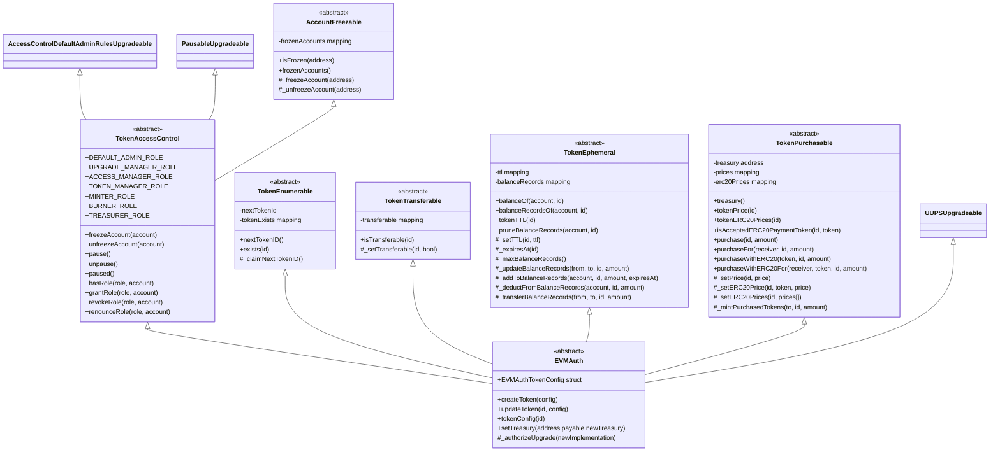
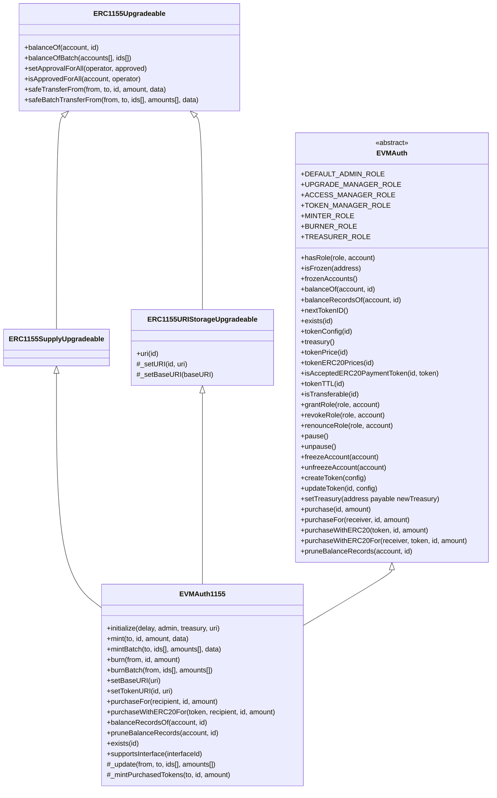
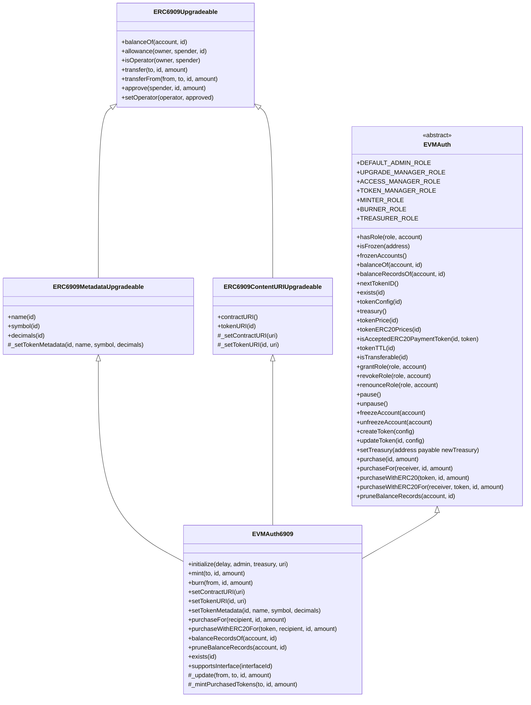

# EVMAuth Core


## Overview

EVMAuth is an **authorization state management system** for APIs, MCP servers, and AI agents.

### Purpose

EVMAuth was created to provide a simple, standardized way to manage persistent authorization without the overhead of developing and maintaining auth servers, databases, subscription management services, and payment systems.

### Use Cases

- **Token-Gated Access Control**: Grant access to digital services, APIs, and AI agents based on token ownership.
- **Subscription Management**: Issue time-limited access tokens for subscription-based services.
- **Metered Usage**: Issue tokens that can be redeemed for usage credits, allowing for pay-as-you-go models.
- **Licensing**: Manage software licenses and entitlements through tokens.
- **Access Revocation**: Instantly revoke access by burning tokens or freezing accounts.
- **Decentralized Identity**: Leverage EVM networks for secure and verifiable identity management.

### Features

Each EVMAuth token type can be configured for direct purchase, with any of the following:

- Native currencies like ETH
- Stablecoins like USDC and USDT
- Any other ERC-20 tokens

Each accepted payment method can be priced independently. If no prices are set (i.e. all prices are zero), direct purchases are disabled for that token type.

EVMAuth tokens can also be issued to users programmatically and redeemed by the issuer at any time. This works well for metered usage models, where tokens are used as credits.

Each EVMAuth token type can be configured with a time-to-live (TTL). If the TTL is set (i.e. greater than zero), tokens of that type will automatically expire. This is ideal for subscription models.

All EVMAuth tokens are transferable by default, but each token type can be made non-transferable. This is useful for non-transferable licenses, identity tokens, or other situations where transfers are undesirable.

### Compatibility

EVMAuth comes in two flavors: [ERC-1155] and [ERC-6909]. Each version is fully compliant with its token standard and, as such, is fully compatible with existing wallets, apps, marketplaces, and other tools that support those standards.

EVMAuth contracts are upgradable by default, using OpenZeppelin's [UUPSUpgradeable] and [ERC-7201] namespaced storage layout, and can be deployed to any EVM-compatible network, including [Ethereum], [Base], [Tron], [Polygon], [Monad], and [Radius].

## Deployment

EVMAuth can be deployed on any EVM-compatible network (e.g. Ethereum, Base, Radius) using the scripts provided in the `scripts/` directory.

When deploying the contract, you will need to specify the following parameters:

- Initial [transfer delay] for the default admin role
- Initial default admin address, [for role management](https://docs.openzeppelin.com/contracts/5.x/api/access#AccessControlDefaultAdminRules)
- Initial treasury address, for receiving revenue from direct purchases
- Role grants, to set up access control during initialization (optional, can be done later)
- Base token metadata URI ([for ERC-1155](https://eips.ethereum.org/EIPS/eip-1155#metadata-extensions)) or contract URI ([for ERC-6909](https://eips.ethereum.org/EIPS/eip-6909#content-uri-extension)) (optional, can be updated later)

## Access Control

If you did not grant roles during initialization, only the default admin can assign roles after deployment, by calling:

- `grantRole(TOKEN_MANAGER_ROLE, address)` for accounts that can configure tokens and token metadata
- `grantRole(ACCESS_MANAGER_ROLE, address)` for accounts that can pause/unpause the contract and freeze accounts
- `grantRole(TREASURER_ROLE, address)` for accounts that can modify the treasury address where funds are collected
- `grantRole(MINTER_ROLE, address)`for accounts that can issue tokens to addresses
- `grantRole(BURNER_ROLE, address)`for accounts that can deduct tokens from addresses

## Token Configuration

An account with the `TOKEN_MANAGER_ROLE` should then create one or more new tokens by calling `createToken` with the desired configuration:

- `uint256 price`: The cost to purchase one unit of the token; 0 means the token cannot be purchased directly; set to `0` to disable native currency purchases
- `PaymentToken[] erc20Prices`: Array of `PaymentToken` structs, each containing ERC-20 `token` address and `price`; pass an empty array to disable ERC-20 token purchases
- `uint256 ttl`: Time-to-live in seconds; 0 means the token never expires; set to 0 for non-expiring tokens
- `bool transferable`: Whether the token can be transferred between accounts

An account with the `TOKEN_MANAGER_ROLE` can modify an existing token by calling `updateToken(id, EVMAuthTokenConfig)`.

## Token Standards

### ERC-1155 vs ERC-6909

<style>
.table-3col-20-40-40 .table-wrapper table {
   th:first-of-type {
      width: 20%;
   }
   th:nth-of-type(2), th:nth-of-type(3) {
      width: 40%;
   }
}
</style>

<div class="table-3col-20-40-40">

| Feature                | ERC-1155                                                                     | ERC-6909                                                                    |
|------------------------|------------------------------------------------------------------------------|-----------------------------------------------------------------------------|
| Callbacks              | Required for each transfer to contract accounts; must return specific values | Removed entirely; no callbacks required                                     |
| Batch Operations       | Included in specification (batch transfers)                                  | Excluded from specification to allow custom implementations                 |
| Permission System      | Single operator scheme: operators get unlimited allowance on all token IDs   | Hybrid scheme: allowances for specific token IDs + operators for all tokens |
| Transfer Methods       | Both transferFrom and safeTransferFrom required; no opt-out for callbacks    | Simplified transfers without mandatory recipient validation                 |
| Transfer Semantics     | Safe transfers with data parameter and receiver hooks                        | Simple transfers without hooks                                              |
| Interface Complexity   | Includes multiple features (callbacks, batching, etc.)                       | Minimized to bare essentials for multi-token management                     |
| Recipient Requirements | Contract recipients must implement callback functions with return values     | No special requirements for contract recipients                             |
| Approval Granularity   | Operators only (all-or-nothing for entire contract)                          | Granular allowances per token ID + full operators                           |
| Metadata Handling      | URI-based metadata (typically off-chain JSON)                                | On-chain name/symbol/decimals per token ID                                  |

</div>

### When to Choose Which

Choose [ERC-1155] when you:
- Need NFT marketplace compatibility
- Batch operations are important
- Want receiver hook notifications
- Prefer URI-based metadata

Choose [ERC-6909] when you:
- Need ERC-20-like semantics per token
- Want granular approval control
- Need on-chain token metadata
- Prefer a simpler token transfer model
- Want to extend the contract with custom features

Both versions of EVMAuth are fairly large. EVMAuth1155 is right near the limit, while EVMAuth6909 has a bit more headroom for expansion.

```text
╭------------------------------+------------------+-------------------+--------------------+---------------------╮
| Contract                     | Runtime Size (B) | Initcode Size (B) | Runtime Margin (B) | Initcode Margin (B) |
+================================================================================================================+
| EVMAuth1155                  | 24,516           | 24,575            | 60                 | 24,577              |
|------------------------------+------------------+-------------------+--------------------+---------------------|
| EVMAuth6909                  | 22,247           | 22,306            | 2,329              | 26,846              |
╰------------------------------+------------------+-------------------+--------------------+---------------------╯
```

## EVMAuth Contract Architecture

### Overview

The EVMAuth contract system is designed with a modular, composable architecture that separates concerns into focused base contracts. This approach provides flexibility while maintaining a clean inheritance structure.

The architecture consists of:

- **Base Contracts**: Modular components that handle specific functionality (e.g. access control, purchasing, token expiry)
- **Base EVMAuth Contract**: Combines all base contracts into a unified authorization state management system
- **Token Standard Implementations**: `EVMAuth1155` and `EVMAuth6909` extend `EVMAuth` with their respective token standards

### Base Contracts Hierarchy



### EVMAuth1155 Implementation



### EVMAuth6909 Implementation



### Base Contract Descriptions

#### TokenAccessControl
Provides role-based access control with six distinct roles, pausable functionality, and account freezing capabilities. Extends OpenZeppelin's AccessControlDefaultAdminRulesUpgradeable for secure admin transfer with time delays.

#### AccountFreezable
Enables freezing and unfreezing of individual accounts, preventing them from transferring or receiving tokens. Maintains a list of frozen accounts for transparency.

#### TokenEnumerable
Manages token ID generation and tracks which token IDs have been created. Provides a sequential ID system starting from 1.

#### TokenTransferable
Controls whether individual token types can be transferred between accounts. Each token ID can be configured as transferable or non-transferable.

#### TokenEphemeral
Implements time-to-live (TTL) functionality for tokens. Tokens with a TTL expire after the specified duration, with automatic pruning of expired balance records. Uses an efficient time-bucket system for gas optimization.

#### TokenPurchasable
Handles direct token purchases with both native currency and ERC-20 tokens. Supports per-token pricing in multiple currencies, with revenue sent to a configurable treasury address. Includes reentrancy protection for secure purchases.

#### EVMAuth
The main abstract contract that combines all base functionality and provides a unified interface for token configuration. Defines the EVMAuthTokenConfig structure that encapsulates price, ERC-20 prices, TTL, and transferability settings for each token type.

## Key Architectural Decisions

1. **Upgradability**: All contracts use the Universal Upgradeable Proxy Standard ([UUPS]) pattern for future improvements

2. **Security**:
   - Role-based access control with time-delayed admin transfers
   - Pausable operations for emergency situations
   - Account freezing capabilities
   - Reentrancy protection on purchase functions

3. **Gas Optimization**:
   - TTL implementation uses bounded arrays and time buckets for balance records
   - Automatic pruning of expired records, with manual pruning methods available
   - Efficient storage patterns for token properties, as defined in [ERC-7201]

4. **Flexibility**:
   - Alternative purchase options (native and/or ERC-20 tokens)
   - Configurable token properties (price, TTL, transferability)
   - Support for both [ERC-1155] and [ERC-6909] token standards

## SDKs & Libraries

EVMAuth provides the following SDKs and libraries for easy integration with applications and frameworks:

- [TypeScript SDK]
- Python SDK (coming soon)

To request additional SDKs or libraries, create a new issue with the `question` label.

You can also use Foundry's [cast] command line tool to interact with deployed EVMAuth contracts, and reference this [Cast Command Cheat Sheet] which illustrates how to call each EVMAuth function.

## Contributing

To contribute to this open source project, please follow the guidelines in the [Contributing Guide].

## License

The **EVMAuth** contract is released under the MIT License. See the [LICENSE] file for details.

[Base]: https://base.org/
[cast]: https://getfoundry.sh/cast/overview
[Cast Command Cheat Sheet]: https://github.com/evmauth/evmauth-core/blob/main/CAST_COMMANDS.md
[Contributing Guide]: https://github.com/evmauth/evmauth-core/blob/main/CONTRIBUTING.md
[ERC-1155]: https://eips.ethereum.org/EIPS/eip-1155
[ERC-6909]: https://eips.ethereum.org/EIPS/eip-6909
[ERC-7201]: https://eips.ethereum.org/EIPS/eip-7201
[Ethereum]: https://ethereum.org/en/
[LICENSE]: https://github.com/evmauth/evmauth-core/blob/main/LICENSE
[Monad]: https://monad.xyz/
[Polygon]: https://polygon.technology/
[Radius]: https://radiustech.xyz/
[transfer delay]: https://docs.openzeppelin.com/contracts/5.x/api/access#AccessControlDefaultAdminRules-defaultAdminDelay--
[Tron]: https://tron.network/
[TypeScript SDK]: https://github.com/evmauth/evmauth-ts
[UUPS]: https://docs.openzeppelin.com/contracts-stylus/0.3.0-rc.1/uups-proxy
[UUPSUpgradeable]: https://docs.openzeppelin.com/contracts/5.x/api/proxy#UUPSUpgradeable