# EVMAuth Smart Contracts Architecture

## Overview

EVMAuth is an authorization state management system for token-gating, built on top of [ERC-1155] and [ERC-6909] token standards.

There are several variations of EVMAuth for each token standard, combining features like upgrade-ability, role-based access control, account freezing, and token configuration (transferability, price, TTL) with optional token expiry and direct token purchasing via native currency or ERC-20 tokens.

## Contract Features

### ERC-1155 Variants

| Contract | Token Standard | Upgradeable Contract | Access Control | Base Config | Native Token Purchase | ERC-20 Purchase | Token Expiry |
|----------|:--------------:|:--------------------:|:--------------:|:-----------:|:---------------------:|:---------------:|:------------:|
| EVMAuth1155 | ERC-1155 | ✅ | ✅ | ✅ | ❌ | ❌ | ❌ |
| EVMAuth1155P | ERC-1155 | ✅ | ✅ | ✅ | ✅ | ❌ | ❌ |
| EVMAuth1155P20 | ERC-1155 | ✅ | ✅ | ✅ | ❌ | ✅ | ❌ |
| EVMAuth1155T | ERC-1155 | ✅ | ✅ | ✅ | ❌ | ❌ | ✅ |
| EVMAuth1155TP | ERC-1155 | ✅ | ✅ | ✅ | ✅ | ❌ | ✅ |
| EVMAuth1155TP20 | ERC-1155 | ✅ | ✅ | ✅ | ❌ | ✅ | ✅ |

### ERC-6909 Variants

| Contract | Token Standard | Upgradeable Contract | Access Control | Base Config | Native Token Purchase | ERC-20 Purchase | Token Expiry |
|----------|:--------------:|:--------------------:|:--------------:|:-----------:|:---------------------:|:---------------:|:------------:|
| EVMAuth6909 | ERC-6909 | ✅ | ✅ | ✅ | ❌ | ❌ | ❌ |
| EVMAuth6909P | ERC-6909 | ✅ | ✅ | ✅ | ✅ | ❌ | ❌ |
| EVMAuth6909P20 | ERC-6909 | ✅ | ✅ | ✅ | ❌ | ✅ | ❌ |
| EVMAuth6909T | ERC-6909 | ✅ | ✅ | ✅ | ❌ | ❌ | ✅ |
| EVMAuth6909TP | ERC-6909 | ✅ | ✅ | ✅ | ✅ | ❌ | ✅ |
| EVMAuth6909TP20 | ERC-6909 | ✅ | ✅ | ✅ | ❌ | ✅ | ✅ |

## Contract Naming Convention

The contract naming follows a clear pattern:
- **Base Name**: `EVMAuth` + Token Standard (`1155` or `6909`)
- **Suffixes**:
    - `T`: Includes TTL (Time-To-Live) and token expiry
    - `P`: Includes price and purchasing via native currency
    - `P20`: Includes price and purchasing via ERC-20 tokens
    - `TP`: Combines TTL + purchasing via native currency
    - `TP20`: Combines TTL + purchasing via ERC-20 tokens

## Token Standards Comparison

### ERC-1155 vs ERC-6909

| Feature | ERC-1155 | ERC-6909 |
|---------|----------|----------|
| **Multi-token Support** | ✅ | ✅ |
| **Batch Operations** | ✅ | ❌ |
| **Operator Approvals** | Per-account | Per-token ID |
| **Metadata** | URI per token | Name, Symbol, Decimals per token |
| **Gas Efficiency** | Good | Better for specific use cases |
| **Adoption** | Widely adopted | Newer standard |

### When to Choose Which

**Use ERC-1155 variants when:**
- You need batch transfer operations
- Broader ecosystem compatibility is required
- Working with NFT marketplaces
- Simple metadata requirements (URI-based)

**Use ERC-6909 variants when:**
- You need granular operator permissions per token ID
- Tokens require individual name/symbol/decimals metadata
- Gas optimization for single transfers is critical
- Building financial or DeFi applications

## Contract Architecture

### TokenAccessControl

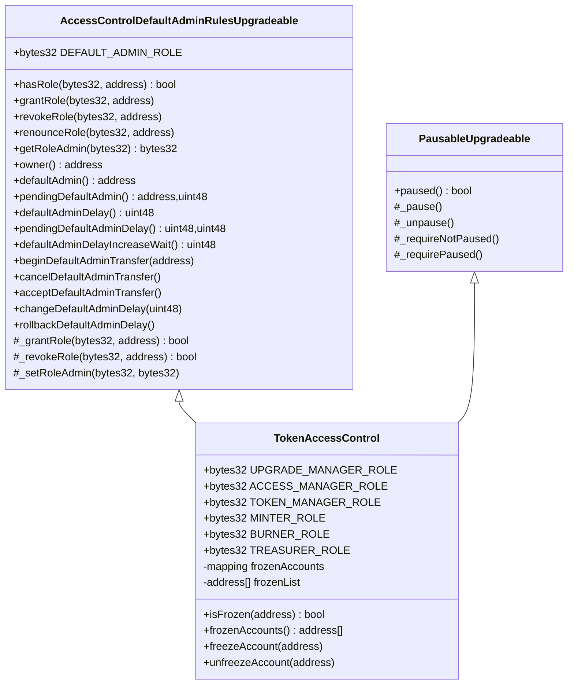
```mermaid
classDiagram
    class AccessControlDefaultAdminRulesUpgradeable{
        +bytes32 DEFAULT_ADMIN_ROLE
        +hasRole(bytes32, address) bool
        +grantRole(bytes32, address)
        +revokeRole(bytes32, address)
        +renounceRole(bytes32, address)
        +getRoleAdmin(bytes32) bytes32
        +owner() address
        +defaultAdmin() address
        +pendingDefaultAdmin() address,uint48
        +defaultAdminDelay() uint48
        +pendingDefaultAdminDelay() uint48,uint48
        +defaultAdminDelayIncreaseWait() uint48
        +beginDefaultAdminTransfer(address)
        +cancelDefaultAdminTransfer()
        +acceptDefaultAdminTransfer()
        +changeDefaultAdminDelay(uint48)
        +rollbackDefaultAdminDelay()
        #_grantRole(bytes32, address) bool
        #_revokeRole(bytes32, address) bool
        #_setRoleAdmin(bytes32, bytes32)
    }
    class PausableUpgradeable{
        +paused() bool
        #_pause()
        #_unpause()
        #_requireNotPaused()
        #_requirePaused()
    }
    class TokenAccessControl{
        +bytes32 UPGRADE_MANAGER_ROLE
        +bytes32 ACCESS_MANAGER_ROLE
        +bytes32 TOKEN_MANAGER_ROLE
        +bytes32 MINTER_ROLE
        +bytes32 BURNER_ROLE
        +bytes32 TREASURER_ROLE
        -mapping frozenAccounts
        -address[] frozenList
        +isFrozen(address) bool
        +frozenAccounts() address[]
        +freezeAccount(address)
        +unfreezeAccount(address)
    }
    
    AccessControlDefaultAdminRulesUpgradeable <|-- TokenAccessControl
    PausableUpgradeable <|-- TokenAccessControl
```

### TokenBaseConfig

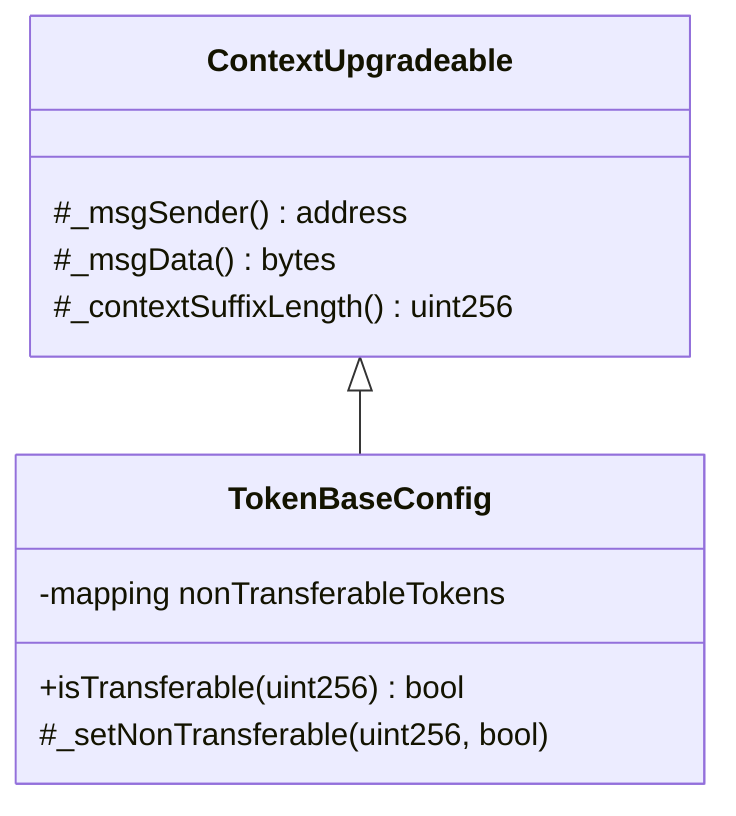
```mermaid
classDiagram
    class ContextUpgradeable{
        #_msgSender() address
        #_msgData() bytes
        #_contextSuffixLength() uint256
    }
    class TokenBaseConfig{
        -mapping nonTransferableTokens
        +isTransferable(uint256) bool
        #_setNonTransferable(uint256, bool)
    }
    
    ContextUpgradeable <|-- TokenBaseConfig
```

### TokenPrice

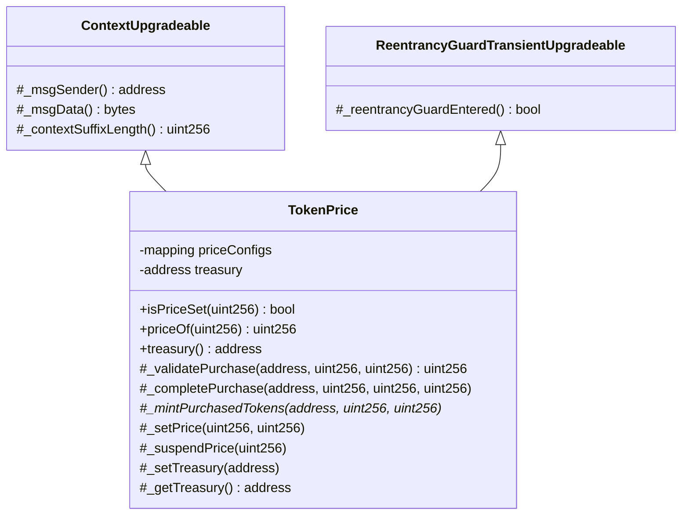
```mermaid
classDiagram
    class ContextUpgradeable{
        #_msgSender() address
        #_msgData() bytes
        #_contextSuffixLength() uint256
    }
    class ReentrancyGuardTransientUpgradeable{
        #_reentrancyGuardEntered() bool
    }
    class TokenPrice{
        -mapping priceConfigs
        -address treasury
        +isPriceSet(uint256) bool
        +priceOf(uint256) uint256
        +treasury() address
        #_validatePurchase(address, uint256, uint256) uint256
        #_completePurchase(address, uint256, uint256, uint256)
        #_mintPurchasedTokens(address, uint256, uint256)*
        #_setPrice(uint256, uint256)
        #_suspendPrice(uint256)
        #_setTreasury(address)
        #_getTreasury() address
    }
    
    ContextUpgradeable <|-- TokenPrice
    ReentrancyGuardTransientUpgradeable <|-- TokenPrice
```

### TokenPurchase

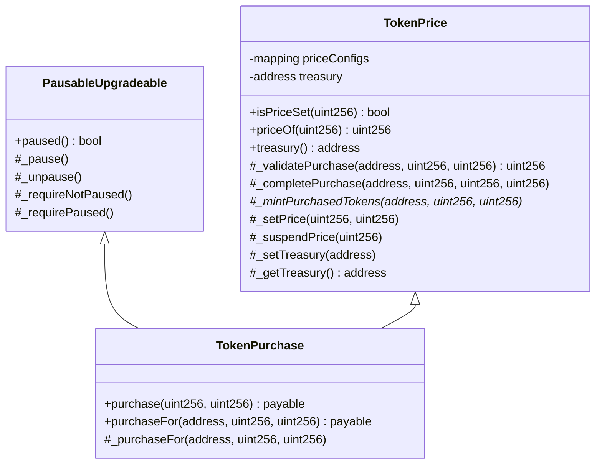
```mermaid
classDiagram
    class PausableUpgradeable{
        +paused() bool
        #_pause()
        #_unpause()
        #_requireNotPaused()
        #_requirePaused()
    }
    class TokenPrice{
        -mapping priceConfigs
        -address treasury
        +isPriceSet(uint256) bool
        +priceOf(uint256) uint256
        +treasury() address
        #_validatePurchase(address, uint256, uint256) uint256
        #_completePurchase(address, uint256, uint256, uint256)
        #_mintPurchasedTokens(address, uint256, uint256)*
        #_setPrice(uint256, uint256)
        #_suspendPrice(uint256)
        #_setTreasury(address)
        #_getTreasury() address
    }
    class TokenPurchase{
        +purchase(uint256, uint256) payable
        +purchaseFor(address, uint256, uint256) payable
        #_purchaseFor(address, uint256, uint256)
    }
    
    PausableUpgradeable <|-- TokenPurchase
    TokenPrice <|-- TokenPurchase
```

### TokenPurchaseERC20

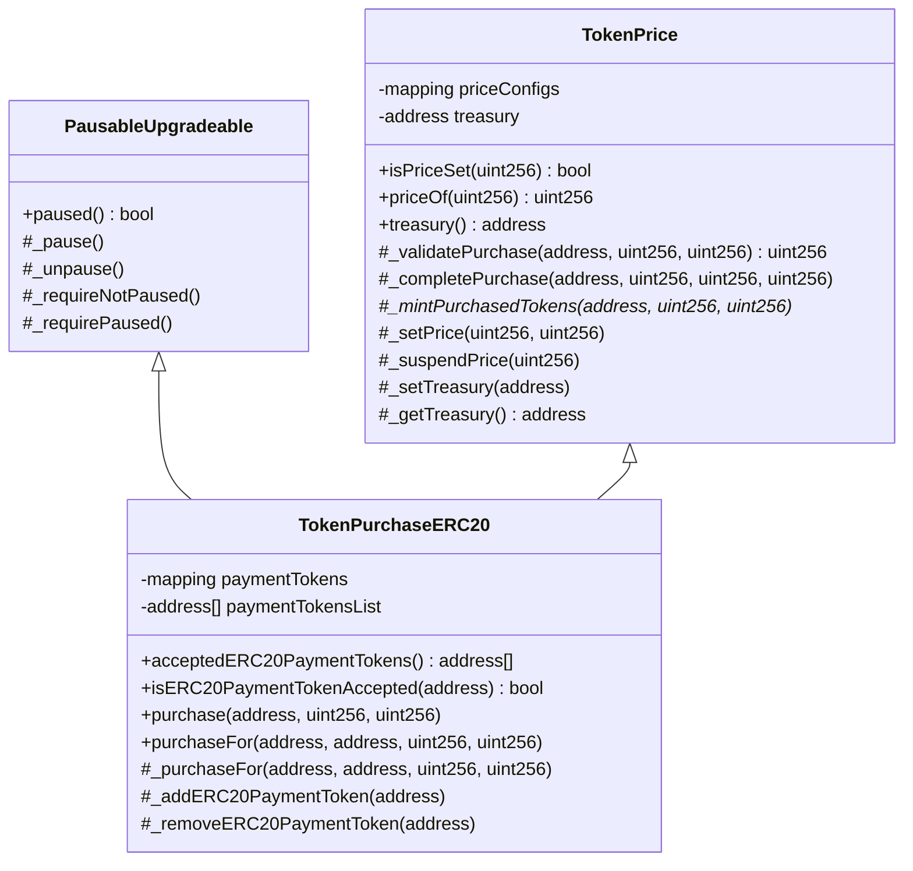
```mermaid
classDiagram
    class PausableUpgradeable{
        +paused() bool
        #_pause()
        #_unpause()
        #_requireNotPaused()
        #_requirePaused()
    }
    class TokenPrice{
        -mapping priceConfigs
        -address treasury
        +isPriceSet(uint256) bool
        +priceOf(uint256) uint256
        +treasury() address
        #_validatePurchase(address, uint256, uint256) uint256
        #_completePurchase(address, uint256, uint256, uint256)
        #_mintPurchasedTokens(address, uint256, uint256)*
        #_setPrice(uint256, uint256)
        #_suspendPrice(uint256)
        #_setTreasury(address)
        #_getTreasury() address
    }
    class TokenPurchaseERC20{
        -mapping paymentTokens
        -address[] paymentTokensList
        +acceptedERC20PaymentTokens() address[]
        +isERC20PaymentTokenAccepted(address) bool
        +purchase(address, uint256, uint256)
        +purchaseFor(address, address, uint256, uint256)
        #_purchaseFor(address, address, uint256, uint256)
        #_addERC20PaymentToken(address)
        #_removeERC20PaymentToken(address)
    }
    
    PausableUpgradeable <|-- TokenPurchaseERC20
    TokenPrice <|-- TokenPurchaseERC20
```

### TokenTTL

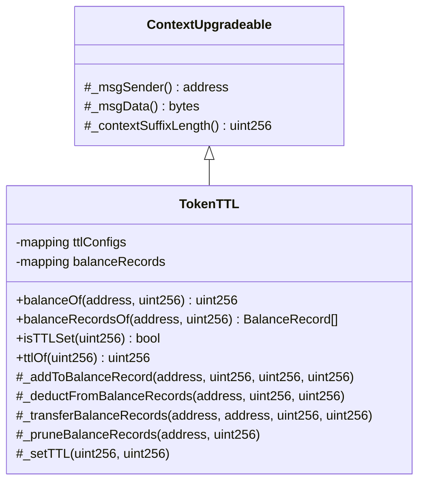
```mermaid
classDiagram
    class ContextUpgradeable{
        #_msgSender() address
        #_msgData() bytes
        #_contextSuffixLength() uint256
    }
    class TokenTTL{
        -mapping ttlConfigs
        -mapping balanceRecords
        +balanceOf(address, uint256) uint256
        +balanceRecordsOf(address, uint256) BalanceRecord[]
        +isTTLSet(uint256) bool
        +ttlOf(uint256) uint256
        #_addToBalanceRecord(address, uint256, uint256, uint256)
        #_deductFromBalanceRecords(address, uint256, uint256)
        #_transferBalanceRecords(address, address, uint256, uint256)
        #_pruneBalanceRecords(address, uint256)
        #_setTTL(uint256, uint256)
    }
    
    ContextUpgradeable <|-- TokenTTL
```

### EVMAuth1155

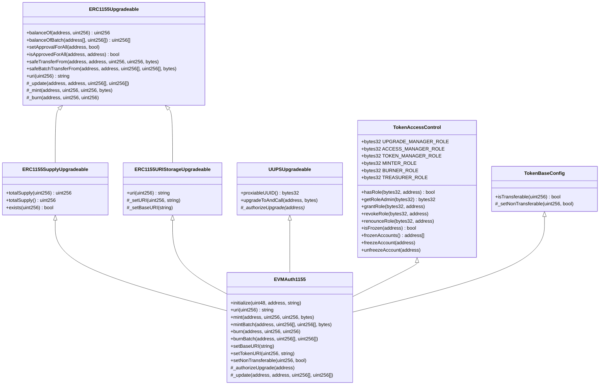
```mermaid
classDiagram
    class ERC1155Upgradeable{
        +balanceOf(address, uint256) uint256
        +balanceOfBatch(address[], uint256[]) uint256[]
        +setApprovalForAll(address, bool)
        +isApprovedForAll(address, address) bool
        +safeTransferFrom(address, address, uint256, uint256, bytes)
        +safeBatchTransferFrom(address, address, uint256[], uint256[], bytes)
        +uri(uint256) string
        #_update(address, address, uint256[], uint256[])
        #_mint(address, uint256, uint256, bytes)
        #_burn(address, uint256, uint256)
    }
    class ERC1155SupplyUpgradeable{
        +totalSupply(uint256) uint256
        +totalSupply() uint256
        +exists(uint256) bool
    }
    class ERC1155URIStorageUpgradeable{
        +uri(uint256) string
        #_setURI(uint256, string)
        #_setBaseURI(string)
    }
    class UUPSUpgradeable{
        +proxiableUUID() bytes32
        +upgradeToAndCall(address, bytes)
        #_authorizeUpgrade(address)*
    }
    class TokenAccessControl{
        +bytes32 UPGRADE_MANAGER_ROLE
        +bytes32 ACCESS_MANAGER_ROLE
        +bytes32 TOKEN_MANAGER_ROLE
        +bytes32 MINTER_ROLE
        +bytes32 BURNER_ROLE
        +bytes32 TREASURER_ROLE
        +hasRole(bytes32, address) bool
        +getRoleAdmin(bytes32) bytes32
        +grantRole(bytes32, address)
        +revokeRole(bytes32, address)
        +renounceRole(bytes32, address)
        +isFrozen(address) bool
        +frozenAccounts() address[]
        +freezeAccount(address)
        +unfreezeAccount(address)
    }
    class TokenBaseConfig{
        +isTransferable(uint256) bool
        #_setNonTransferable(uint256, bool)
    }
    class EVMAuth1155{
        +initialize(uint48, address, string)
        +uri(uint256) string
        +mint(address, uint256, uint256, bytes)
        +mintBatch(address, uint256[], uint256[], bytes)
        +burn(address, uint256, uint256)
        +burnBatch(address, uint256[], uint256[])
        +setBaseURI(string)
        +setTokenURI(uint256, string)
        +setNonTransferable(uint256, bool)
        #_authorizeUpgrade(address)
        #_update(address, address, uint256[], uint256[])
    }
    
    ERC1155Upgradeable <|-- ERC1155SupplyUpgradeable
    ERC1155Upgradeable <|-- ERC1155URIStorageUpgradeable
    ERC1155SupplyUpgradeable <|-- EVMAuth1155
    ERC1155URIStorageUpgradeable <|-- EVMAuth1155
    UUPSUpgradeable <|-- EVMAuth1155
    TokenAccessControl <|-- EVMAuth1155
    TokenBaseConfig <|-- EVMAuth1155
```

### EVMAuth1155P

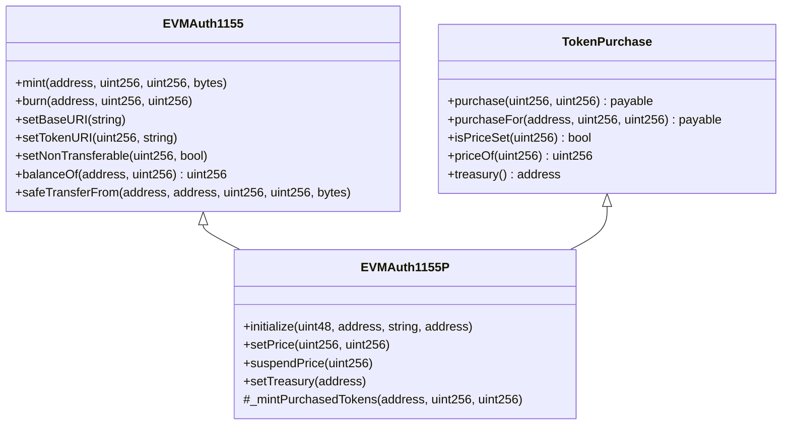
```mermaid
classDiagram
    class EVMAuth1155{
        +mint(address, uint256, uint256, bytes)
        +burn(address, uint256, uint256)
        +setBaseURI(string)
        +setTokenURI(uint256, string)
        +setNonTransferable(uint256, bool)
        +balanceOf(address, uint256) uint256
        +safeTransferFrom(address, address, uint256, uint256, bytes)
    }
    class TokenPurchase{
        +purchase(uint256, uint256) payable
        +purchaseFor(address, uint256, uint256) payable
        +isPriceSet(uint256) bool
        +priceOf(uint256) uint256
        +treasury() address
    }
    class EVMAuth1155P{
        +initialize(uint48, address, string, address)
        +setPrice(uint256, uint256)
        +suspendPrice(uint256)
        +setTreasury(address)
        #_mintPurchasedTokens(address, uint256, uint256)
    }
    
    EVMAuth1155 <|-- EVMAuth1155P
    TokenPurchase <|-- EVMAuth1155P
```

### EVMAuth1155P20

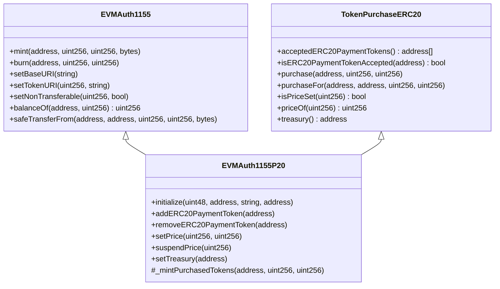
```mermaid
classDiagram
    class EVMAuth1155{
        +mint(address, uint256, uint256, bytes)
        +burn(address, uint256, uint256)
        +setBaseURI(string)
        +setTokenURI(uint256, string)
        +setNonTransferable(uint256, bool)
        +balanceOf(address, uint256) uint256
        +safeTransferFrom(address, address, uint256, uint256, bytes)
    }
    class TokenPurchaseERC20{
        +acceptedERC20PaymentTokens() address[]
        +isERC20PaymentTokenAccepted(address) bool
        +purchase(address, uint256, uint256)
        +purchaseFor(address, address, uint256, uint256)
        +isPriceSet(uint256) bool
        +priceOf(uint256) uint256
        +treasury() address
    }
    class EVMAuth1155P20{
        +initialize(uint48, address, string, address)
        +addERC20PaymentToken(address)
        +removeERC20PaymentToken(address)
        +setPrice(uint256, uint256)
        +suspendPrice(uint256)
        +setTreasury(address)
        #_mintPurchasedTokens(address, uint256, uint256)
    }
    
    EVMAuth1155 <|-- EVMAuth1155P20
    TokenPurchaseERC20 <|-- EVMAuth1155P20
```

### EVMAuth1155T

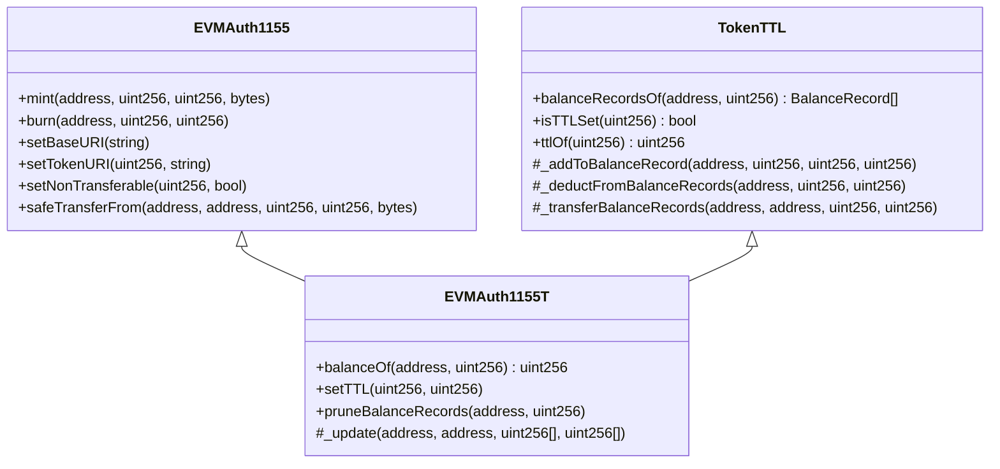
```mermaid
classDiagram
    class EVMAuth1155{
        +mint(address, uint256, uint256, bytes)
        +burn(address, uint256, uint256)
        +setBaseURI(string)
        +setTokenURI(uint256, string)
        +setNonTransferable(uint256, bool)
        +safeTransferFrom(address, address, uint256, uint256, bytes)
    }
    class TokenTTL{
        +balanceRecordsOf(address, uint256) BalanceRecord[]
        +isTTLSet(uint256) bool
        +ttlOf(uint256) uint256
        #_addToBalanceRecord(address, uint256, uint256, uint256)
        #_deductFromBalanceRecords(address, uint256, uint256)
        #_transferBalanceRecords(address, address, uint256, uint256)
    }
    class EVMAuth1155T{
        +balanceOf(address, uint256) uint256
        +setTTL(uint256, uint256)
        +pruneBalanceRecords(address, uint256)
        #_update(address, address, uint256[], uint256[])
    }
    
    EVMAuth1155 <|-- EVMAuth1155T
    TokenTTL <|-- EVMAuth1155T
```

### EVMAuth1155TP

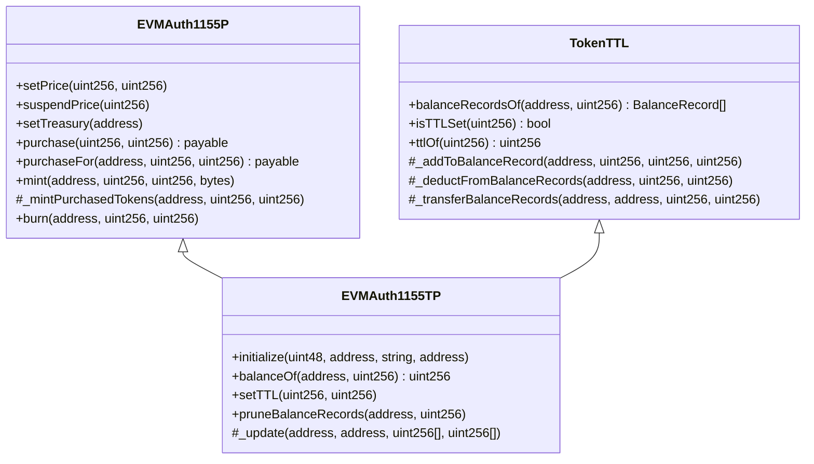
```mermaid
classDiagram
    class EVMAuth1155P{
        +setPrice(uint256, uint256)
        +suspendPrice(uint256)
        +setTreasury(address)
        +purchase(uint256, uint256) payable
        +purchaseFor(address, uint256, uint256) payable
        +mint(address, uint256, uint256, bytes)
        #_mintPurchasedTokens(address, uint256, uint256)
        +burn(address, uint256, uint256)
    }
    class TokenTTL{
        +balanceRecordsOf(address, uint256) BalanceRecord[]
        +isTTLSet(uint256) bool
        +ttlOf(uint256) uint256
        #_addToBalanceRecord(address, uint256, uint256, uint256)
        #_deductFromBalanceRecords(address, uint256, uint256)
        #_transferBalanceRecords(address, address, uint256, uint256)
    }
    class EVMAuth1155TP{
        +initialize(uint48, address, string, address)
        +balanceOf(address, uint256) uint256
        +setTTL(uint256, uint256)
        +pruneBalanceRecords(address, uint256)
        #_update(address, address, uint256[], uint256[])
    }
    
    EVMAuth1155P <|-- EVMAuth1155TP
    TokenTTL <|-- EVMAuth1155TP
```

### EVMAuth1155TP20

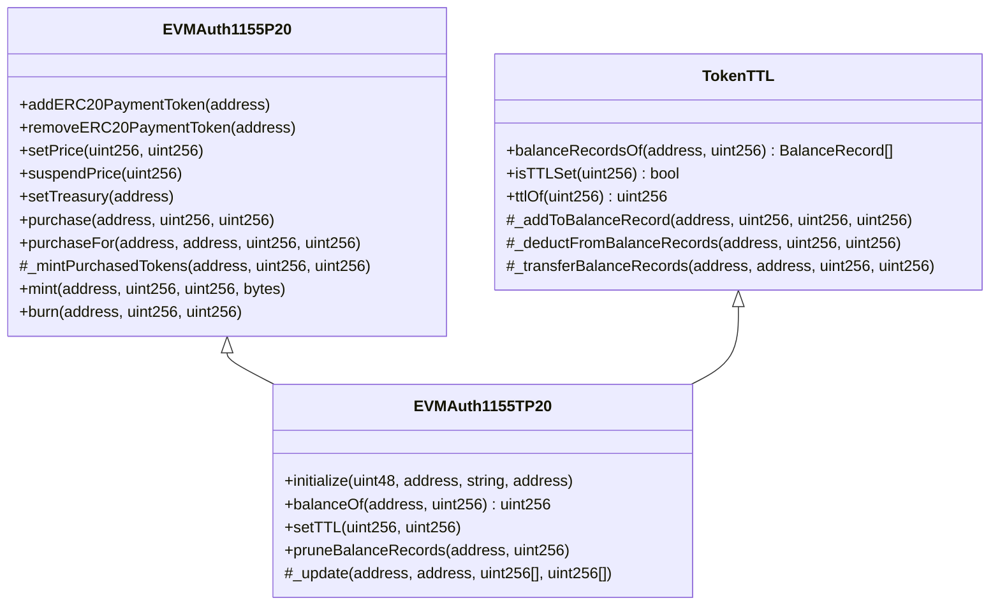
```mermaid
classDiagram
    class EVMAuth1155P20{
        +addERC20PaymentToken(address)
        +removeERC20PaymentToken(address)
        +setPrice(uint256, uint256)
        +suspendPrice(uint256)
        +setTreasury(address)
        +purchase(address, uint256, uint256)
        +purchaseFor(address, address, uint256, uint256)
        #_mintPurchasedTokens(address, uint256, uint256)
        +mint(address, uint256, uint256, bytes)
        +burn(address, uint256, uint256)
    }
    class TokenTTL{
        +balanceRecordsOf(address, uint256) BalanceRecord[]
        +isTTLSet(uint256) bool
        +ttlOf(uint256) uint256
        #_addToBalanceRecord(address, uint256, uint256, uint256)
        #_deductFromBalanceRecords(address, uint256, uint256)
        #_transferBalanceRecords(address, address, uint256, uint256)
    }
    class EVMAuth1155TP20{
        +initialize(uint48, address, string, address)
        +balanceOf(address, uint256) uint256
        +setTTL(uint256, uint256)
        +pruneBalanceRecords(address, uint256)
        #_update(address, address, uint256[], uint256[])
    }
    
    EVMAuth1155P20 <|-- EVMAuth1155TP20
    TokenTTL <|-- EVMAuth1155TP20
```

### EVMAuth6909

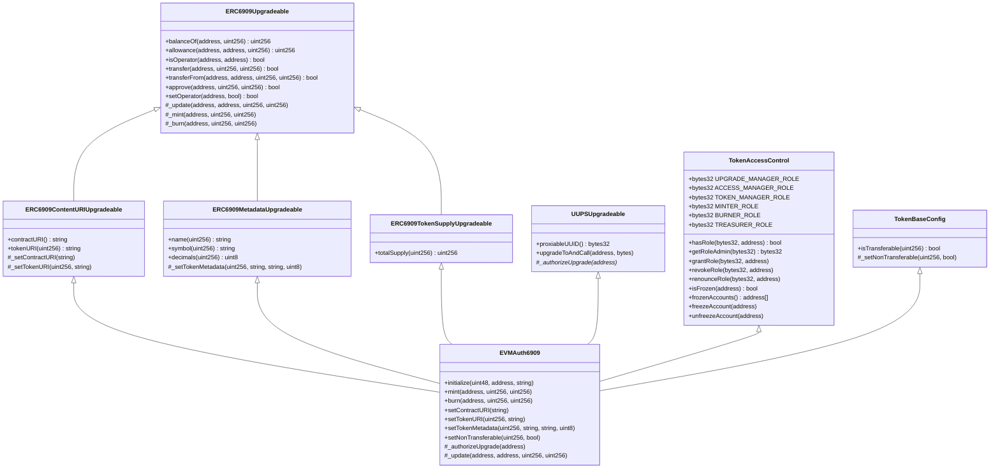
```mermaid
classDiagram
    class ERC6909Upgradeable{
        +balanceOf(address, uint256) uint256
        +allowance(address, address, uint256) uint256
        +isOperator(address, address) bool
        +transfer(address, uint256, uint256) bool
        +transferFrom(address, address, uint256, uint256) bool
        +approve(address, uint256, uint256) bool
        +setOperator(address, bool) bool
        #_update(address, address, uint256, uint256)
        #_mint(address, uint256, uint256)
        #_burn(address, uint256, uint256)
    }
    class ERC6909ContentURIUpgradeable{
        +contractURI() string
        +tokenURI(uint256) string
        #_setContractURI(string)
        #_setTokenURI(uint256, string)
    }
    class ERC6909MetadataUpgradeable{
        +name(uint256) string
        +symbol(uint256) string
        +decimals(uint256) uint8
        #_setTokenMetadata(uint256, string, string, uint8)
    }
    class ERC6909TokenSupplyUpgradeable{
        +totalSupply(uint256) uint256
    }
    class UUPSUpgradeable{
        +proxiableUUID() bytes32
        +upgradeToAndCall(address, bytes)
        #_authorizeUpgrade(address)*
    }
    class TokenAccessControl{
        +bytes32 UPGRADE_MANAGER_ROLE
        +bytes32 ACCESS_MANAGER_ROLE
        +bytes32 TOKEN_MANAGER_ROLE
        +bytes32 MINTER_ROLE
        +bytes32 BURNER_ROLE
        +bytes32 TREASURER_ROLE
        +hasRole(bytes32, address) bool
        +getRoleAdmin(bytes32) bytes32
        +grantRole(bytes32, address)
        +revokeRole(bytes32, address)
        +renounceRole(bytes32, address)
        +isFrozen(address) bool
        +frozenAccounts() address[]
        +freezeAccount(address)
        +unfreezeAccount(address)
    }
    class TokenBaseConfig{
        +isTransferable(uint256) bool
        #_setNonTransferable(uint256, bool)
    }
    class EVMAuth6909{
        +initialize(uint48, address, string)
        +mint(address, uint256, uint256)
        +burn(address, uint256, uint256)
        +setContractURI(string)
        +setTokenURI(uint256, string)
        +setTokenMetadata(uint256, string, string, uint8)
        +setNonTransferable(uint256, bool)
        #_authorizeUpgrade(address)
        #_update(address, address, uint256, uint256)
    }
    
    ERC6909Upgradeable <|-- ERC6909ContentURIUpgradeable
    ERC6909Upgradeable <|-- ERC6909MetadataUpgradeable
    ERC6909Upgradeable <|-- ERC6909TokenSupplyUpgradeable
    ERC6909ContentURIUpgradeable <|-- EVMAuth6909
    ERC6909MetadataUpgradeable <|-- EVMAuth6909
    ERC6909TokenSupplyUpgradeable <|-- EVMAuth6909
    UUPSUpgradeable <|-- EVMAuth6909
    TokenAccessControl <|-- EVMAuth6909
    TokenBaseConfig <|-- EVMAuth6909
```

### EVMAuth6909P

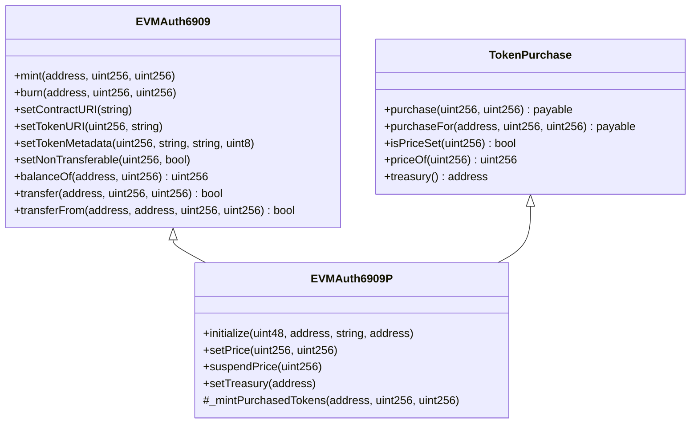
```mermaid
classDiagram
    class EVMAuth6909{
        +mint(address, uint256, uint256)
        +burn(address, uint256, uint256)
        +setContractURI(string)
        +setTokenURI(uint256, string)
        +setTokenMetadata(uint256, string, string, uint8)
        +setNonTransferable(uint256, bool)
        +balanceOf(address, uint256) uint256
        +transfer(address, uint256, uint256) bool
        +transferFrom(address, address, uint256, uint256) bool
    }
    class TokenPurchase{
        +purchase(uint256, uint256) payable
        +purchaseFor(address, uint256, uint256) payable
        +isPriceSet(uint256) bool
        +priceOf(uint256) uint256
        +treasury() address
    }
    class EVMAuth6909P{
        +initialize(uint48, address, string, address)
        +setPrice(uint256, uint256)
        +suspendPrice(uint256)
        +setTreasury(address)
        #_mintPurchasedTokens(address, uint256, uint256)
    }
    
    EVMAuth6909 <|-- EVMAuth6909P
    TokenPurchase <|-- EVMAuth6909P
```

### EVMAuth6909P20

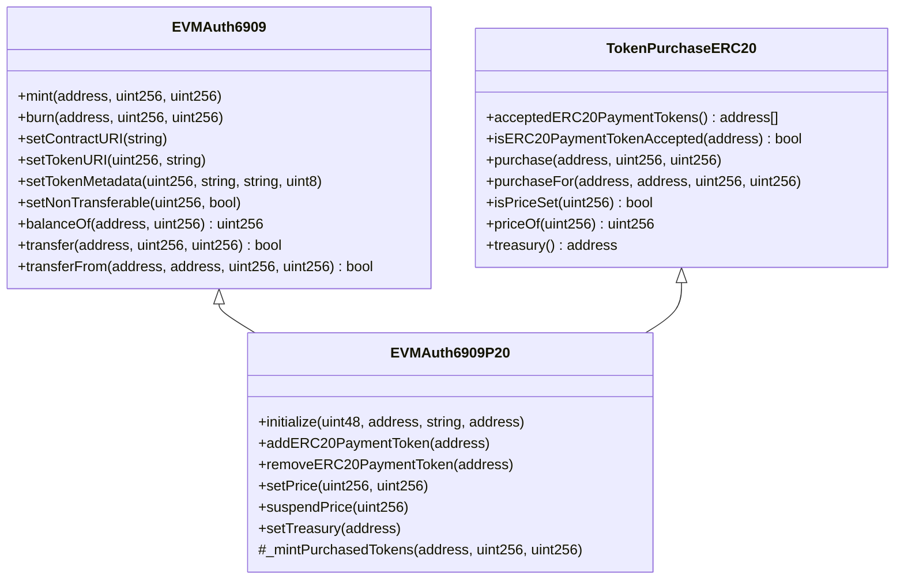
```mermaid
classDiagram
    class EVMAuth6909{
        +mint(address, uint256, uint256)
        +burn(address, uint256, uint256)
        +setContractURI(string)
        +setTokenURI(uint256, string)
        +setTokenMetadata(uint256, string, string, uint8)
        +setNonTransferable(uint256, bool)
        +balanceOf(address, uint256) uint256
        +transfer(address, uint256, uint256) bool
        +transferFrom(address, address, uint256, uint256) bool
    }
    class TokenPurchaseERC20{
        +acceptedERC20PaymentTokens() address[]
        +isERC20PaymentTokenAccepted(address) bool
        +purchase(address, uint256, uint256)
        +purchaseFor(address, address, uint256, uint256)
        +isPriceSet(uint256) bool
        +priceOf(uint256) uint256
        +treasury() address
    }
    class EVMAuth6909P20{
        +initialize(uint48, address, string, address)
        +addERC20PaymentToken(address)
        +removeERC20PaymentToken(address)
        +setPrice(uint256, uint256)
        +suspendPrice(uint256)
        +setTreasury(address)
        #_mintPurchasedTokens(address, uint256, uint256)
    }
    
    EVMAuth6909 <|-- EVMAuth6909P20
    TokenPurchaseERC20 <|-- EVMAuth6909P20
```

### EVMAuth6909T

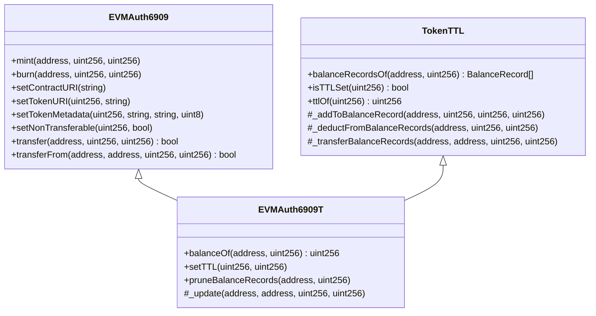
```mermaid
classDiagram
    class EVMAuth6909{
        +mint(address, uint256, uint256)
        +burn(address, uint256, uint256)
        +setContractURI(string)
        +setTokenURI(uint256, string)
        +setTokenMetadata(uint256, string, string, uint8)
        +setNonTransferable(uint256, bool)
        +transfer(address, uint256, uint256) bool
        +transferFrom(address, address, uint256, uint256) bool
    }
    class TokenTTL{
        +balanceRecordsOf(address, uint256) BalanceRecord[]
        +isTTLSet(uint256) bool
        +ttlOf(uint256) uint256
        #_addToBalanceRecord(address, uint256, uint256, uint256)
        #_deductFromBalanceRecords(address, uint256, uint256)
        #_transferBalanceRecords(address, address, uint256, uint256)
    }
    class EVMAuth6909T{
        +balanceOf(address, uint256) uint256
        +setTTL(uint256, uint256)
        +pruneBalanceRecords(address, uint256)
        #_update(address, address, uint256, uint256)
    }
    
    EVMAuth6909 <|-- EVMAuth6909T
    TokenTTL <|-- EVMAuth6909T
```

### EVMAuth6909TP

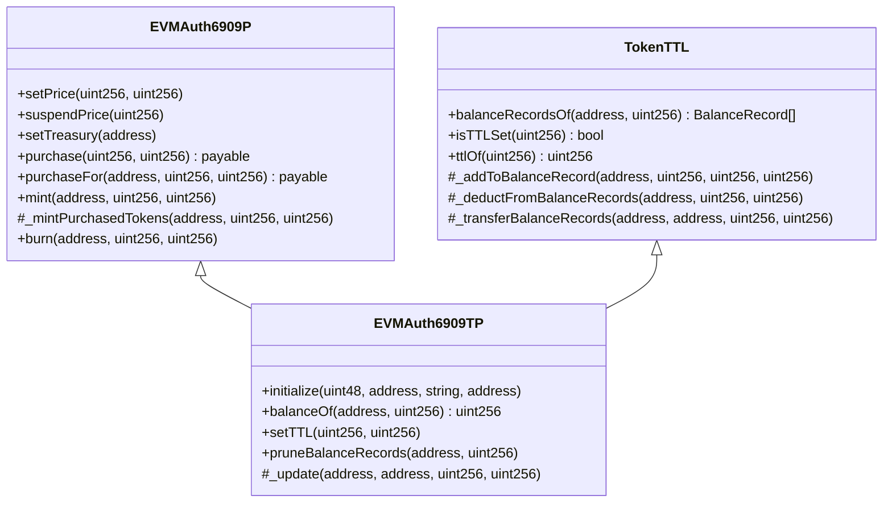
```mermaid
classDiagram
    class EVMAuth6909P{
        +setPrice(uint256, uint256)
        +suspendPrice(uint256)
        +setTreasury(address)
        +purchase(uint256, uint256) payable
        +purchaseFor(address, uint256, uint256) payable
        +mint(address, uint256, uint256)
        #_mintPurchasedTokens(address, uint256, uint256)
        +burn(address, uint256, uint256)
    }
    class TokenTTL{
        +balanceRecordsOf(address, uint256) BalanceRecord[]
        +isTTLSet(uint256) bool
        +ttlOf(uint256) uint256
        #_addToBalanceRecord(address, uint256, uint256, uint256)
        #_deductFromBalanceRecords(address, uint256, uint256)
        #_transferBalanceRecords(address, address, uint256, uint256)
    }
    class EVMAuth6909TP{
        +initialize(uint48, address, string, address)
        +balanceOf(address, uint256) uint256
        +setTTL(uint256, uint256)
        +pruneBalanceRecords(address, uint256)
        #_update(address, address, uint256, uint256)
    }
    
    EVMAuth6909P <|-- EVMAuth6909TP
    TokenTTL <|-- EVMAuth6909TP
```

### EVMAuth6909TP20

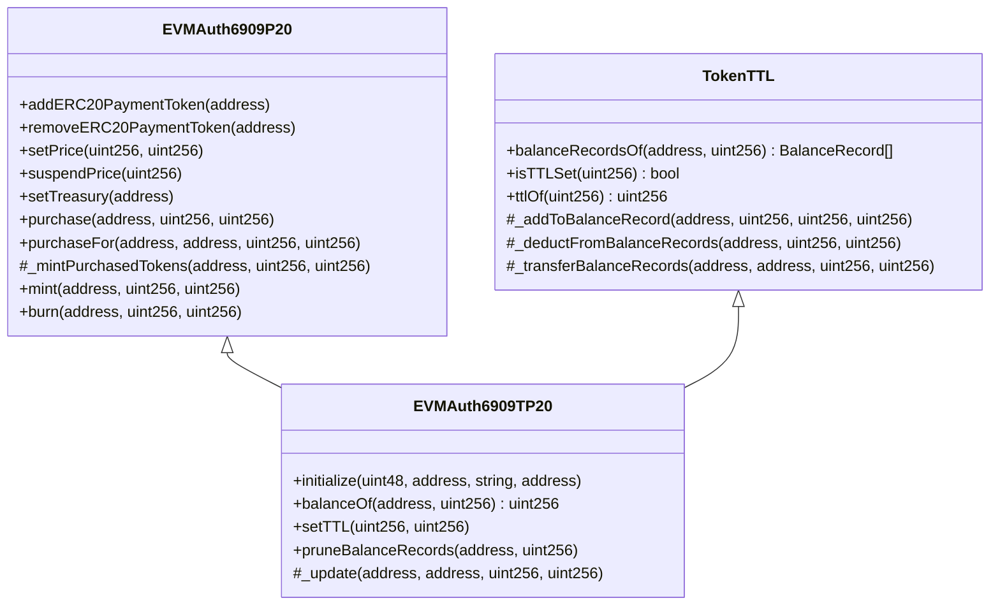
```mermaid
classDiagram
    class EVMAuth6909P20{
        +addERC20PaymentToken(address)
        +removeERC20PaymentToken(address)
        +setPrice(uint256, uint256)
        +suspendPrice(uint256)
        +setTreasury(address)
        +purchase(address, uint256, uint256)
        +purchaseFor(address, address, uint256, uint256)
        #_mintPurchasedTokens(address, uint256, uint256)
        +mint(address, uint256, uint256)
        +burn(address, uint256, uint256)
    }
    class TokenTTL{
        +balanceRecordsOf(address, uint256) BalanceRecord[]
        +isTTLSet(uint256) bool
        +ttlOf(uint256) uint256
        #_addToBalanceRecord(address, uint256, uint256, uint256)
        #_deductFromBalanceRecords(address, uint256, uint256)
        #_transferBalanceRecords(address, address, uint256, uint256)
    }
    class EVMAuth6909TP20{
        +initialize(uint48, address, string, address)
        +balanceOf(address, uint256) uint256
        +setTTL(uint256, uint256)
        +pruneBalanceRecords(address, uint256)
        #_update(address, address, uint256, uint256)
    }
    
    EVMAuth6909P20 <|-- EVMAuth6909TP20
    TokenTTL <|-- EVMAuth6909TP20
```

## Contract Mixins

### TokenAccessControl
Provides role-based access control:
- **Roles:**
  - `DEFAULT_ADMIN_ROLE`: Assign/revoke other roles
  - `UPGRADE_MANAGER_ROLE`: Perform contract upgrades
  - `ACCESS_MANAGER_ROLE`: Pause/unpause and account freezing
  - `TOKEN_MANAGER_ROLE`: Token configuration, pricing, and metadata
  - `MINTER_ROLE`: Minting tokens
  - `BURNER_ROLE`: Burning tokens
  - `TREASURER_ROLE`: Modify treasury account (for purchase variants)
- **Features:**
  - Pausable operations
  - Account freezing capability
  - Time-delayed admin role transfers

### TokenBaseConfig
- Allows marking specific token IDs as non-transferable
- Non-transferable tokens can only be minted or burned

### TokenTTL (Time-To-Live)
- Adds automatic token expiration functionality
- Each token ID can have a configured TTL (time-to-live)
- Maintains balance records with expiration timestamps
- Automatically excludes expired tokens from balance queries
- Supports balance record pruning for gas optimization

### TokenPrice
- Base pricing functionality for tokens
- Treasury management for collecting revenues
- Purchase suspension capability

### TokenPurchase (extends TokenPrice)
- Direct purchase with native currency (e.g., ETH, POL)
- Automatic minting upon purchase
- Revenue collection to treasury

### TokenPurchaseERC20 (extends TokenPrice)
- Direct purchase with ERC-20 tokens (e.g., USDC, USDT)
- Support for any ERC-20 payment token
- Configurable payment token per token ID

## Key Architectural Decisions

1. **Upgradability**: All contracts use the UUPS (Universal Upgradeable Proxy Standard) pattern for future improvements

2. **Modularity**: Features are separated into mixins that can be combined as needed

3. **Security**: 
   - Role-based access control with time-delayed admin transfers
   - Pausable operations for emergency situations
   - Account freezing capabilities
   - Reentrancy protection on purchase functions

4. **Gas Optimization**:
   - TTL implementation uses bounded arrays and time buckets for balance records
   - Automatic pruning of expired records, with manual pruning methods available
   - Efficient storage patterns for token properties

5. **Flexibility**: 
   - Alternative purchase options (native, ERC-20)
   - Configurable token properties (transferability, TTL, pricing)
   - Support for both ERC-1155 and ERC-6909 token standards

## Deployment Considerations

1. **Initialization**:
   - Admin role [transfer delay]
   - Admin address ([for role management])
   - Base URI ([for ERC-1155]) or Contract URI ([for ERC-6909])
   - Treasury address (for `P` and `P20` contract variants)

2. **Role Assignment**:
   - `grantRole(TOKEN_MANAGER_ROLE, address)` for accounts that can configure tokens and token metadata
   - `grantRole(ACCESS_MANAGER_ROLE, address)` for accounts that can pause/unpause the contract and freeze accounts
   - `grantRole(TREASURER_ROLE, address)` for accounts that can modify the treasury address where funds are collected
   - `grantRole(MINTER_ROLE, address)`for accounts that can issue tokens to addresses
   - `grantRole(BURNER_ROLE, address)`for accounts that can deduct tokens from addresses

3. **Token Configuration**:
   - Configure transferability
   - Set TTL (if enabled)
   - Set price (if enabled)
   - Set metadata/URI (if applicable)

[ERC-1155]: https://eips.ethereum.org/EIPS/eip-1155
[ERC-6909]: https://eips.ethereum.org/EIPS/eip-6909
[transfer delay]: https://docs.openzeppelin.com/contracts/5.x/api/access#AccessControlDefaultAdminRules-defaultAdminDelay--
[for role management]: https://docs.openzeppelin.com/contracts/5.x/api/access#AccessControlDefaultAdminRules
[for ERC-1155]: https://eips.ethereum.org/EIPS/eip-1155#metadata-extensions
[for ERC-6909]: https://eips.ethereum.org/EIPS/eip-6909#content-uri-extension
