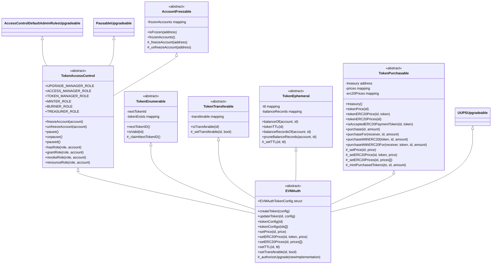
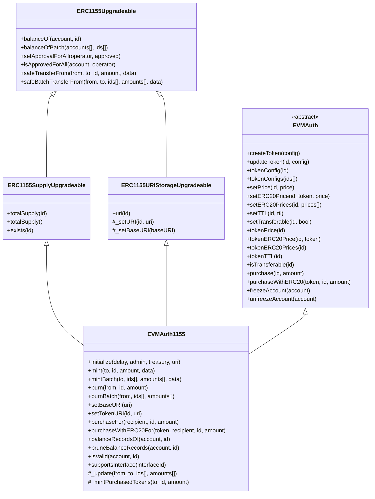
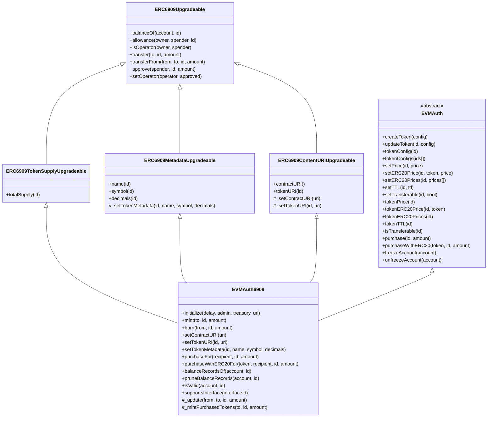

# EVMAuth Contract Architecture

### Overview

The EVMAuth contract system is designed with a modular, composable architecture that separates concerns into focused base contracts. This approach provides flexibility while maintaining a clean inheritance structure.

The architecture consists of:

- **Base Contracts**: Modular components that handle specific functionality (e.g. access control, purchasing, token expiry)
- **Base EVMAuth Contract**: Combines all base contracts into a unified authorization state management system
- **Token Standard Implementations**: `EVMAuth1155` and `EVMAuth6909` extend `EVMAuth` with their respective token standards

### Base Contracts Hierarchy

### EVMAuth1155 Implementation

### EVMAuth6909 Implementation

### Base Contract Descriptions

#### TokenAccessControl
Provides role-based access control with six distinct roles, pausable functionality, and account freezing capabilities. Extends OpenZeppelin's AccessControlDefaultAdminRulesUpgradeable for secure admin transfer with time delays.

#### AccountFreezable
Enables freezing and unfreezing of individual accounts, preventing them from transferring or receiving tokens. Maintains a list of frozen accounts for transparency.

#### TokenEnumerable
Manages token ID generation and tracks which token IDs have been created. Provides a sequential ID system starting from 1.

#### TokenTransferable
Controls whether individual token types can be transferred between accounts. Each token ID can be configured as transferable or non-transferable.

#### TokenEphemeral
Implements time-to-live (TTL) functionality for tokens. Tokens with a TTL expire after the specified duration, with automatic pruning of expired balance records. Uses an efficient time-bucket system for gas optimization.

#### TokenPurchasable
Handles direct token purchases with both native currency and ERC-20 tokens. Supports per-token pricing in multiple currencies, with revenue sent to a configurable treasury address. Includes reentrancy protection for secure purchases.

#### EVMAuth
The main abstract contract that combines all base functionality and provides a unified interface for token configuration. Defines the EVMAuthTokenConfig structure that encapsulates price, ERC-20 prices, TTL, and transferability settings for each token type.

[ERC-1155]: https://eips.ethereum.org/EIPS/eip-1155
[ERC-6909]: https://eips.ethereum.org/EIPS/eip-6909
[ERC-7201]: https://eips.ethereum.org/EIPS/eip-7201
[for ERC-1155]: https://eips.ethereum.org/EIPS/eip-1155#metadata-extensions
[for ERC-6909]: https://eips.ethereum.org/EIPS/eip-6909#content-uri-extension
[for role management]: https://docs.openzeppelin.com/contracts/5.x/api/access#AccessControlDefaultAdminRules
[transfer delay]: https://docs.openzeppelin.com/contracts/5.x/api/access#AccessControlDefaultAdminRules-defaultAdminDelay--
[UUPS]: https://docs.openzeppelin.com/contracts-stylus/0.3.0-rc.1/uups-proxy
