# EVMAuth Smart Contracts Architecture

## Overview

EVMAuth is an authorization state management system for token-gating, built on top of [ERC-1155] and [ERC-6909] token standards.

## Token Standards Comparison

### ERC-1155 vs ERC-6909

| Feature                | ERC-1155                                                                     | ERC-6909                                                                    |
|------------------------|------------------------------------------------------------------------------|-----------------------------------------------------------------------------|
| Callbacks              | Required for each transfer to contract accounts; must return specific values | Removed entirely; no callbacks required                                     |
| Batch Operations       | Included in specification (batch transfers)                                  | Excluded from specification to allow custom implementations                 |
| Permission System      | Single operator scheme: operators get unlimited allowance on all token IDs   | Hybrid scheme: allowances for specific token IDs + operators for all tokens |
| Transfer Methods       | Both transferFrom and safeTransferFrom required; no opt-out for callbacks    | Simplified transfers without mandatory recipient validation                 |
| Transfer Semantics     | Safe transfers with data parameter and receiver hooks                        | Simple transfers without hooks                                              |
| Interface Complexity   | Includes multiple features (callbacks, batching, etc.)                       | Minimized to bare essentials for multi-token management                     |
| Recipient Requirements | Contract recipients must implement callback functions with return values     | No special requirements for contract recipients                             |
| Approval Granularity   | Operators only (all-or-nothing for entire contract)                          | Granular allowances per token ID + full operators                           |
| Metadata Handling      | URI-based metadata (typically off-chain JSON)                                | On-chain name/symbol/decimals per token ID                                  |
| Supply Tracking        | Global `totalSupply()` plus per-token supply                                 | Only per-token `totalSupply(id)`                                            |

### When to Choose Which

Choose [ERC-1155] when you:
- Need NFT marketplace compatibility
- Batch operations are important
- Want receiver hook notifications
- Prefer URI-based metadata

Choose [ERC-6909] when you:
- Need ERC-20-like semantics per token
- Want granular approval control
- Need on-chain token metadata
- Prefer a simpler token transfer model

## Key Architectural Decisions

1. **Upgradability**: All contracts use the [UUPS] (Universal Upgradeable Proxy Standard) pattern for future improvements

2. **Security**:
    - Role-based access control with time-delayed admin transfers
    - Pausable operations for emergency situations
    - Account freezing capabilities
    - Reentrancy protection on purchase functions

3. **Gas Optimization**:
    - TTL implementation uses bounded arrays and time buckets for balance records
    - Automatic pruning of expired records, with manual pruning methods available
    - Efficient storage patterns for token properties

4. **Flexibility**:
    - Alternative purchase options (native tokens, ERC-20)
    - Configurable token properties (price, TTL, transferability)
    - Support for both ERC-1155 and ERC-6909 token standards

## Deployment Considerations

1. **Initialization**:
    - Admin role [transfer delay]
    - Admin address [for role management]
    - Treasury address (for direct purchase revenue)
    - Base URI ([for ERC-1155]) or Contract URI ([for ERC-6909])

2. **Role Assignment**:
    - `grantRole(TOKEN_MANAGER_ROLE, address)` for accounts that can configure tokens and token metadata
    - `grantRole(ACCESS_MANAGER_ROLE, address)` for accounts that can pause/unpause the contract and freeze accounts
    - `grantRole(TREASURER_ROLE, address)` for accounts that can modify the treasury address where funds are collected
    - `grantRole(MINTER_ROLE, address)`for accounts that can issue tokens to addresses
    - `grantRole(BURNER_ROLE, address)`for accounts that can deduct tokens from addresses

3. **Token Configuration**:
    - Make sure your account has been granted `TOKEN_MANAGER_ROLE`
    - Create a new token with `createToken(EVMAuthTokenConfig)`, where `EVMAuthTokenConfig` includes:
       - `uint256 price`: The cost to purchase one unit of the token; 0 means the token cannot be purchased directly
       - `uint256 ttl`: Time-to-live in seconds; 0 means the token never expires
       - `bool transferable`: Whether the token can be transferred between accounts
    - Modify an existing token with `updateToken(id, EVMAuthTokenConfig)`

## Contract Architecture

### TokenAccessControl

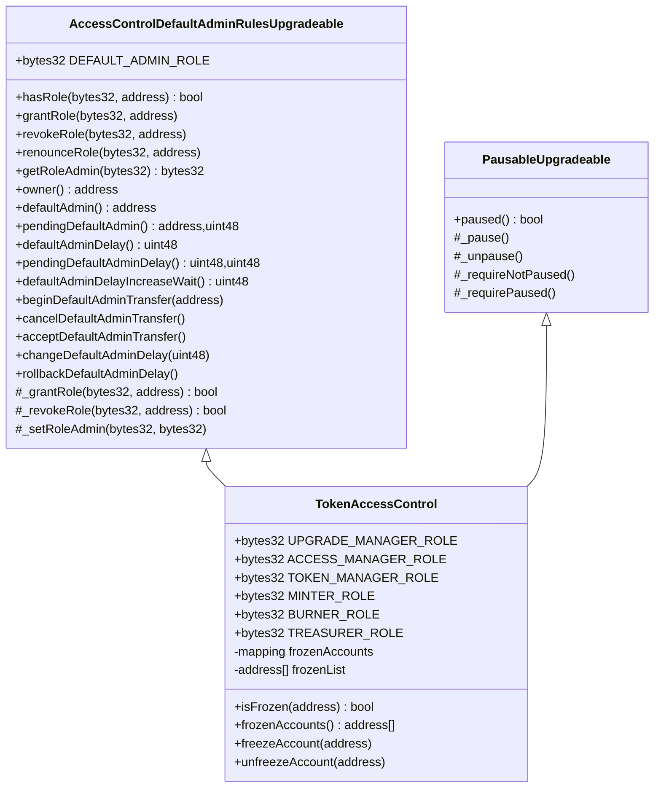
```mermaid
classDiagram
    class AccessControlDefaultAdminRulesUpgradeable{
        +bytes32 DEFAULT_ADMIN_ROLE
        +hasRole(bytes32, address) bool
        +grantRole(bytes32, address)
        +revokeRole(bytes32, address)
        +renounceRole(bytes32, address)
        +getRoleAdmin(bytes32) bytes32
        +owner() address
        +defaultAdmin() address
        +pendingDefaultAdmin() address,uint48
        +defaultAdminDelay() uint48
        +pendingDefaultAdminDelay() uint48,uint48
        +defaultAdminDelayIncreaseWait() uint48
        +beginDefaultAdminTransfer(address)
        +cancelDefaultAdminTransfer()
        +acceptDefaultAdminTransfer()
        +changeDefaultAdminDelay(uint48)
        +rollbackDefaultAdminDelay()
        #_grantRole(bytes32, address) bool
        #_revokeRole(bytes32, address) bool
        #_setRoleAdmin(bytes32, bytes32)
    }
    class PausableUpgradeable{
        +paused() bool
        #_pause()
        #_unpause()
        #_requireNotPaused()
        #_requirePaused()
    }
    class TokenAccessControl{
        +bytes32 UPGRADE_MANAGER_ROLE
        +bytes32 ACCESS_MANAGER_ROLE
        +bytes32 TOKEN_MANAGER_ROLE
        +bytes32 MINTER_ROLE
        +bytes32 BURNER_ROLE
        +bytes32 TREASURER_ROLE
        -mapping frozenAccounts
        -address[] frozenList
        +isFrozen(address) bool
        +frozenAccounts() address[]
        +freezeAccount(address)
        +unfreezeAccount(address)
    }
    
    AccessControlDefaultAdminRulesUpgradeable <|-- TokenAccessControl
    PausableUpgradeable <|-- TokenAccessControl
```

### TokenConfiguration

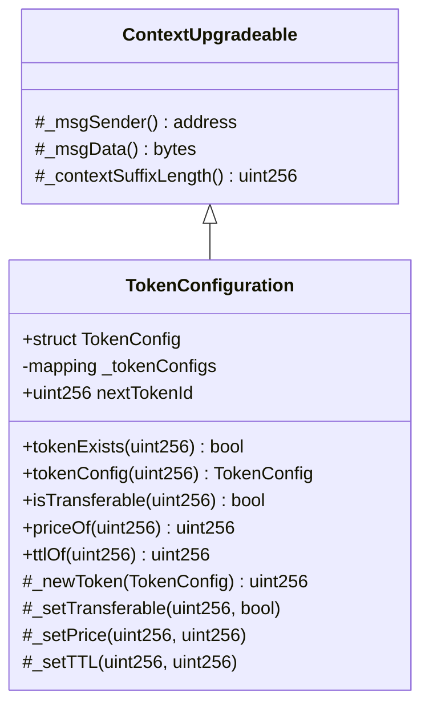
```mermaid
classDiagram
    class ContextUpgradeable{
        #_msgSender() address
        #_msgData() bytes
        #_contextSuffixLength() uint256
    }
    class TokenConfiguration{
        +struct TokenConfig
        -mapping _tokenConfigs
        +uint256 nextTokenId
        +tokenExists(uint256) bool
        +tokenConfig(uint256) TokenConfig
        +isTransferable(uint256) bool
        +priceOf(uint256) uint256
        +ttlOf(uint256) uint256
        #_newToken(TokenConfig) uint256
        #_setTransferable(uint256, bool)
        #_setPrice(uint256, uint256)
        #_setTTL(uint256, uint256)
    }
    
    ContextUpgradeable <|-- TokenConfiguration
```

### TokenPrice

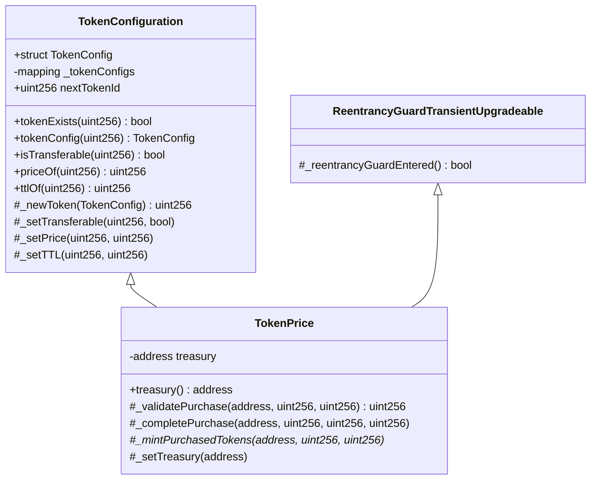
```mermaid
classDiagram
    class TokenConfiguration{
        +struct TokenConfig
        -mapping _tokenConfigs
        +uint256 nextTokenId
        +tokenExists(uint256) bool
        +tokenConfig(uint256) TokenConfig
        +isTransferable(uint256) bool
        +priceOf(uint256) uint256
        +ttlOf(uint256) uint256
        #_newToken(TokenConfig) uint256
        #_setTransferable(uint256, bool)
        #_setPrice(uint256, uint256)
        #_setTTL(uint256, uint256)
    }
    class ReentrancyGuardTransientUpgradeable{
        #_reentrancyGuardEntered() bool
    }
    class TokenPrice{
        -address treasury
        +treasury() address
        #_validatePurchase(address, uint256, uint256) uint256
        #_completePurchase(address, uint256, uint256, uint256)
        #_mintPurchasedTokens(address, uint256, uint256)*
        #_setTreasury(address)
    }
    
    TokenConfiguration <|-- TokenPrice
    ReentrancyGuardTransientUpgradeable <|-- TokenPrice
```

### TokenPurchase

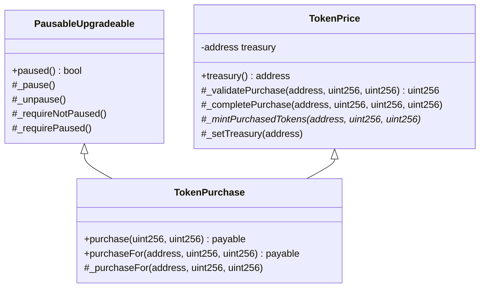
```mermaid
classDiagram
    class PausableUpgradeable{
        +paused() bool
        #_pause()
        #_unpause()
        #_requireNotPaused()
        #_requirePaused()
    }
    class TokenPrice{
        -address treasury
        +treasury() address
        #_validatePurchase(address, uint256, uint256) uint256
        #_completePurchase(address, uint256, uint256, uint256)
        #_mintPurchasedTokens(address, uint256, uint256)*
        #_setTreasury(address)
    }
    class TokenPurchase{
        +purchase(uint256, uint256) payable
        +purchaseFor(address, uint256, uint256) payable
        #_purchaseFor(address, uint256, uint256)
    }
    
    PausableUpgradeable <|-- TokenPurchase
    TokenPrice <|-- TokenPurchase
```

### TokenPurchaseERC20

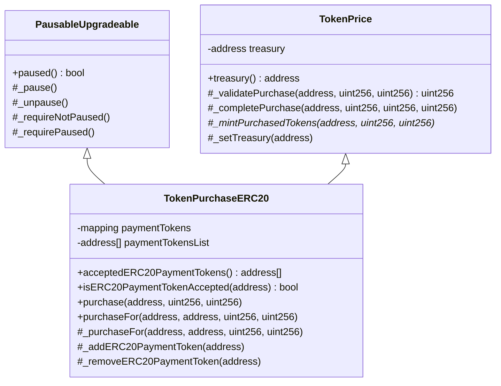
```mermaid
classDiagram
    class PausableUpgradeable{
        +paused() bool
        #_pause()
        #_unpause()
        #_requireNotPaused()
        #_requirePaused()
    }
    class TokenPrice{
        -address treasury
        +treasury() address
        #_validatePurchase(address, uint256, uint256) uint256
        #_completePurchase(address, uint256, uint256, uint256)
        #_mintPurchasedTokens(address, uint256, uint256)*
        #_setTreasury(address)
    }
    class TokenPurchaseERC20{
        -mapping paymentTokens
        -address[] paymentTokensList
        +acceptedERC20PaymentTokens() address[]
        +isERC20PaymentTokenAccepted(address) bool
        +purchase(address, uint256, uint256)
        +purchaseFor(address, address, uint256, uint256)
        #_purchaseFor(address, address, uint256, uint256)
        #_addERC20PaymentToken(address)
        #_removeERC20PaymentToken(address)
    }
    
    PausableUpgradeable <|-- TokenPurchaseERC20
    TokenPrice <|-- TokenPurchaseERC20
```

### TokenExpiry

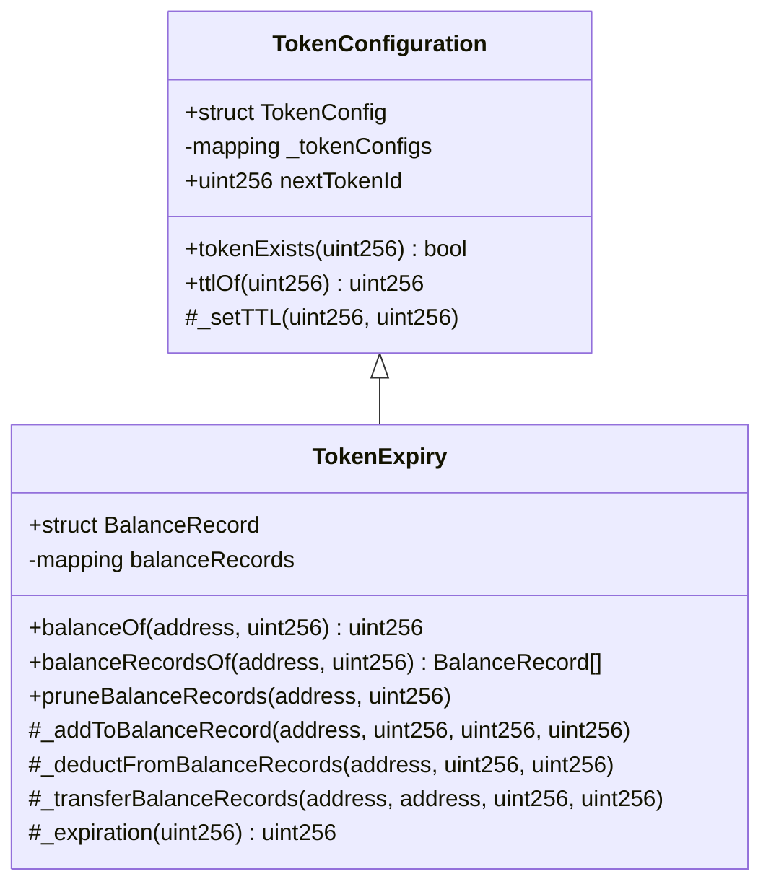
```mermaid
classDiagram
    class TokenConfiguration{
        +struct TokenConfig
        -mapping _tokenConfigs
        +uint256 nextTokenId
        +tokenExists(uint256) bool
        +ttlOf(uint256) uint256
        #_setTTL(uint256, uint256)
    }
    class TokenExpiry{
        +struct BalanceRecord
        -mapping balanceRecords
        +balanceOf(address, uint256) uint256
        +balanceRecordsOf(address, uint256) BalanceRecord[]
        +pruneBalanceRecords(address, uint256)
        #_addToBalanceRecord(address, uint256, uint256, uint256)
        #_deductFromBalanceRecords(address, uint256, uint256)
        #_transferBalanceRecords(address, address, uint256, uint256)
        #_expiration(uint256) uint256
    }
    
    TokenConfiguration <|-- TokenExpiry
```

### EVMAuth1155

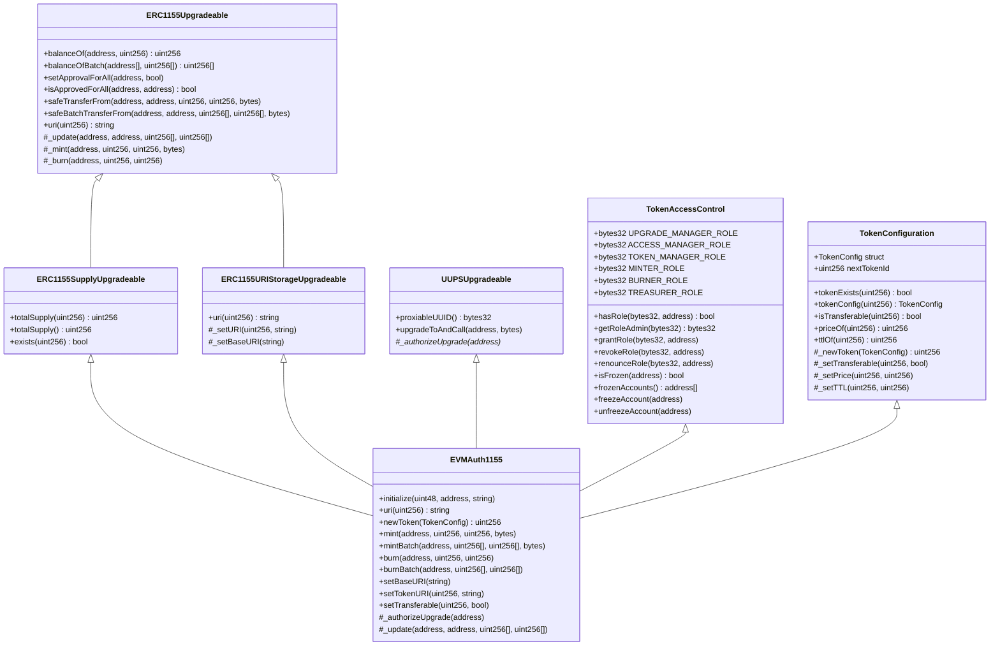
```mermaid
classDiagram
    class ERC1155Upgradeable{
        +balanceOf(address, uint256) uint256
        +balanceOfBatch(address[], uint256[]) uint256[]
        +setApprovalForAll(address, bool)
        +isApprovedForAll(address, address) bool
        +safeTransferFrom(address, address, uint256, uint256, bytes)
        +safeBatchTransferFrom(address, address, uint256[], uint256[], bytes)
        +uri(uint256) string
        #_update(address, address, uint256[], uint256[])
        #_mint(address, uint256, uint256, bytes)
        #_burn(address, uint256, uint256)
    }
    class ERC1155SupplyUpgradeable{
        +totalSupply(uint256) uint256
        +totalSupply() uint256
        +exists(uint256) bool
    }
    class ERC1155URIStorageUpgradeable{
        +uri(uint256) string
        #_setURI(uint256, string)
        #_setBaseURI(string)
    }
    class UUPSUpgradeable{
        +proxiableUUID() bytes32
        +upgradeToAndCall(address, bytes)
        #_authorizeUpgrade(address)*
    }
    class TokenAccessControl{
        +bytes32 UPGRADE_MANAGER_ROLE
        +bytes32 ACCESS_MANAGER_ROLE
        +bytes32 TOKEN_MANAGER_ROLE
        +bytes32 MINTER_ROLE
        +bytes32 BURNER_ROLE
        +bytes32 TREASURER_ROLE
        +hasRole(bytes32, address) bool
        +getRoleAdmin(bytes32) bytes32
        +grantRole(bytes32, address)
        +revokeRole(bytes32, address)
        +renounceRole(bytes32, address)
        +isFrozen(address) bool
        +frozenAccounts() address[]
        +freezeAccount(address)
        +unfreezeAccount(address)
    }
    class TokenConfiguration{
        +TokenConfig struct
        +uint256 nextTokenId
        +tokenExists(uint256) bool
        +tokenConfig(uint256) TokenConfig
        +isTransferable(uint256) bool
        +priceOf(uint256) uint256
        +ttlOf(uint256) uint256
        #_newToken(TokenConfig) uint256
        #_setTransferable(uint256, bool)
        #_setPrice(uint256, uint256)
        #_setTTL(uint256, uint256)
    }
    class EVMAuth1155{
        +initialize(uint48, address, string)
        +uri(uint256) string
        +newToken(TokenConfig) uint256
        +mint(address, uint256, uint256, bytes)
        +mintBatch(address, uint256[], uint256[], bytes)
        +burn(address, uint256, uint256)
        +burnBatch(address, uint256[], uint256[])
        +setBaseURI(string)
        +setTokenURI(uint256, string)
        +setTransferable(uint256, bool)
        #_authorizeUpgrade(address)
        #_update(address, address, uint256[], uint256[])
    }
    
    ERC1155Upgradeable <|-- ERC1155SupplyUpgradeable
    ERC1155Upgradeable <|-- ERC1155URIStorageUpgradeable
    ERC1155SupplyUpgradeable <|-- EVMAuth1155
    ERC1155URIStorageUpgradeable <|-- EVMAuth1155
    UUPSUpgradeable <|-- EVMAuth1155
    TokenAccessControl <|-- EVMAuth1155
    TokenConfiguration <|-- EVMAuth1155
```

### EVMAuth1155P

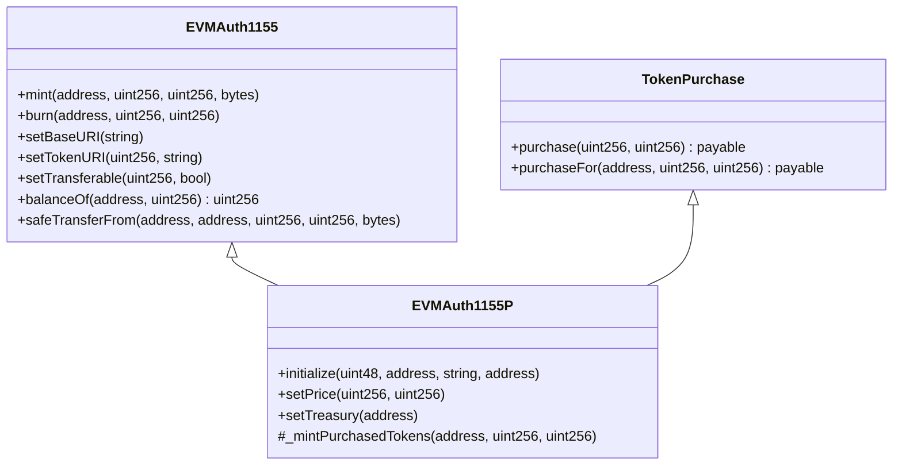
```mermaid
classDiagram
    class EVMAuth1155{
        +mint(address, uint256, uint256, bytes)
        +burn(address, uint256, uint256)
        +setBaseURI(string)
        +setTokenURI(uint256, string)
        +setTransferable(uint256, bool)
        +balanceOf(address, uint256) uint256
        +safeTransferFrom(address, address, uint256, uint256, bytes)
    }
    class TokenPurchase{
        +purchase(uint256, uint256) payable
        +purchaseFor(address, uint256, uint256) payable
    }
    class EVMAuth1155P{
        +initialize(uint48, address, string, address)
        +setPrice(uint256, uint256)
        +setTreasury(address)
        #_mintPurchasedTokens(address, uint256, uint256)
    }
    
    EVMAuth1155 <|-- EVMAuth1155P
    TokenPurchase <|-- EVMAuth1155P
```

### EVMAuth1155P20

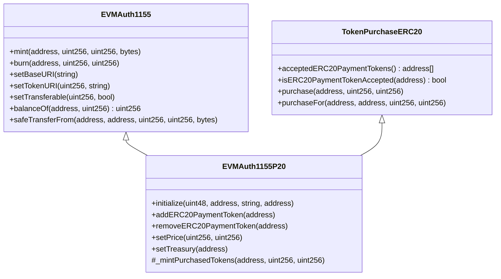
```mermaid
classDiagram
    class EVMAuth1155{
        +mint(address, uint256, uint256, bytes)
        +burn(address, uint256, uint256)
        +setBaseURI(string)
        +setTokenURI(uint256, string)
        +setTransferable(uint256, bool)
        +balanceOf(address, uint256) uint256
        +safeTransferFrom(address, address, uint256, uint256, bytes)
    }
    class TokenPurchaseERC20{
        +acceptedERC20PaymentTokens() address[]
        +isERC20PaymentTokenAccepted(address) bool
        +purchase(address, uint256, uint256)
        +purchaseFor(address, address, uint256, uint256)
    }
    class EVMAuth1155P20{
        +initialize(uint48, address, string, address)
        +addERC20PaymentToken(address)
        +removeERC20PaymentToken(address)
        +setPrice(uint256, uint256)
        +setTreasury(address)
        #_mintPurchasedTokens(address, uint256, uint256)
    }
    
    EVMAuth1155 <|-- EVMAuth1155P20
    TokenPurchaseERC20 <|-- EVMAuth1155P20
```

### EVMAuth1155X

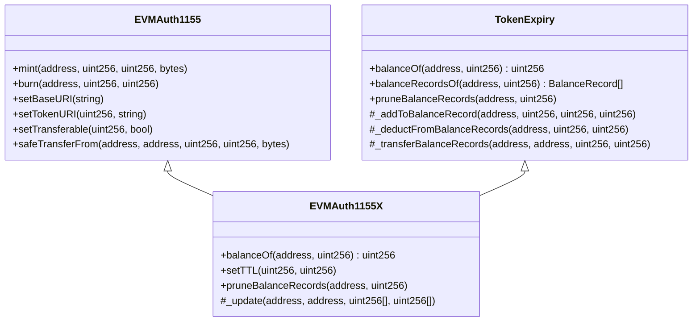
```mermaid
classDiagram
    class EVMAuth1155{
        +mint(address, uint256, uint256, bytes)
        +burn(address, uint256, uint256)
        +setBaseURI(string)
        +setTokenURI(uint256, string)
        +setTransferable(uint256, bool)
        +safeTransferFrom(address, address, uint256, uint256, bytes)
    }
    class TokenExpiry{
        +balanceOf(address, uint256) uint256
        +balanceRecordsOf(address, uint256) BalanceRecord[]
        +pruneBalanceRecords(address, uint256)
        #_addToBalanceRecord(address, uint256, uint256, uint256)
        #_deductFromBalanceRecords(address, uint256, uint256)
        #_transferBalanceRecords(address, address, uint256, uint256)
    }
    class EVMAuth1155X{
        +balanceOf(address, uint256) uint256
        +setTTL(uint256, uint256)
        +pruneBalanceRecords(address, uint256)
        #_update(address, address, uint256[], uint256[])
    }
    
    EVMAuth1155 <|-- EVMAuth1155X
    TokenExpiry <|-- EVMAuth1155X
```

### EVMAuth1155XP

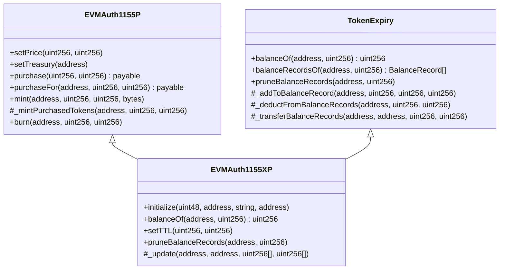
```mermaid
classDiagram
    class EVMAuth1155P{
        +setPrice(uint256, uint256)
        +setTreasury(address)
        +purchase(uint256, uint256) payable
        +purchaseFor(address, uint256, uint256) payable
        +mint(address, uint256, uint256, bytes)
        #_mintPurchasedTokens(address, uint256, uint256)
        +burn(address, uint256, uint256)
    }
    class TokenExpiry{
        +balanceOf(address, uint256) uint256
        +balanceRecordsOf(address, uint256) BalanceRecord[]
        +pruneBalanceRecords(address, uint256)
        #_addToBalanceRecord(address, uint256, uint256, uint256)
        #_deductFromBalanceRecords(address, uint256, uint256)
        #_transferBalanceRecords(address, address, uint256, uint256)
    }
    class EVMAuth1155XP{
        +initialize(uint48, address, string, address)
        +balanceOf(address, uint256) uint256
        +setTTL(uint256, uint256)
        +pruneBalanceRecords(address, uint256)
        #_update(address, address, uint256[], uint256[])
    }
    
    EVMAuth1155P <|-- EVMAuth1155XP
    TokenExpiry <|-- EVMAuth1155XP
```

### EVMAuth1155XP20

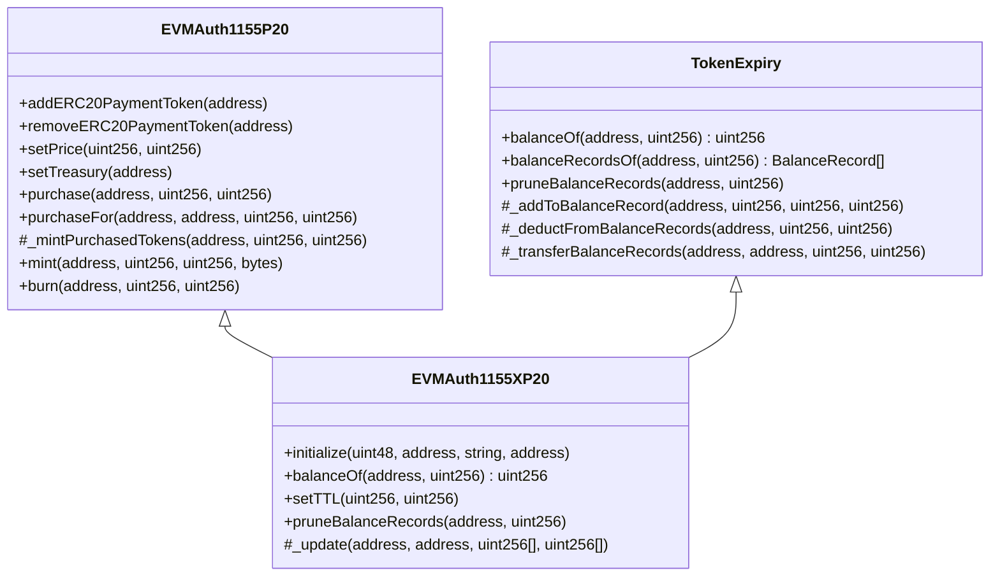
```mermaid
classDiagram
    class EVMAuth1155P20{
        +addERC20PaymentToken(address)
        +removeERC20PaymentToken(address)
        +setPrice(uint256, uint256)
        +setTreasury(address)
        +purchase(address, uint256, uint256)
        +purchaseFor(address, address, uint256, uint256)
        #_mintPurchasedTokens(address, uint256, uint256)
        +mint(address, uint256, uint256, bytes)
        +burn(address, uint256, uint256)
    }
    class TokenExpiry{
        +balanceOf(address, uint256) uint256
        +balanceRecordsOf(address, uint256) BalanceRecord[]
        +pruneBalanceRecords(address, uint256)
        #_addToBalanceRecord(address, uint256, uint256, uint256)
        #_deductFromBalanceRecords(address, uint256, uint256)
        #_transferBalanceRecords(address, address, uint256, uint256)
    }
    class EVMAuth1155XP20{
        +initialize(uint48, address, string, address)
        +balanceOf(address, uint256) uint256
        +setTTL(uint256, uint256)
        +pruneBalanceRecords(address, uint256)
        #_update(address, address, uint256[], uint256[])
    }
    
    EVMAuth1155P20 <|-- EVMAuth1155XP20
    TokenExpiry <|-- EVMAuth1155XP20
```

### EVMAuth6909

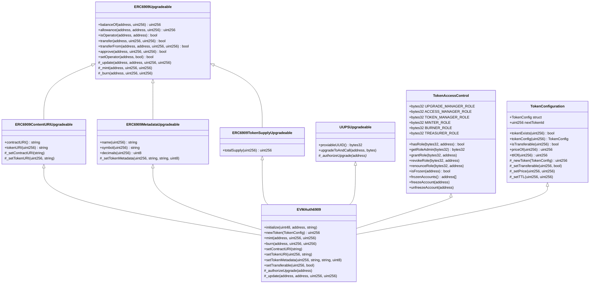
```mermaid
classDiagram
    class ERC6909Upgradeable{
        +balanceOf(address, uint256) uint256
        +allowance(address, address, uint256) uint256
        +isOperator(address, address) bool
        +transfer(address, uint256, uint256) bool
        +transferFrom(address, address, uint256, uint256) bool
        +approve(address, uint256, uint256) bool
        +setOperator(address, bool) bool
        #_update(address, address, uint256, uint256)
        #_mint(address, uint256, uint256)
        #_burn(address, uint256, uint256)
    }
    class ERC6909ContentURIUpgradeable{
        +contractURI() string
        +tokenURI(uint256) string
        #_setContractURI(string)
        #_setTokenURI(uint256, string)
    }
    class ERC6909MetadataUpgradeable{
        +name(uint256) string
        +symbol(uint256) string
        +decimals(uint256) uint8
        #_setTokenMetadata(uint256, string, string, uint8)
    }
    class ERC6909TokenSupplyUpgradeable{
        +totalSupply(uint256) uint256
    }
    class UUPSUpgradeable{
        +proxiableUUID() bytes32
        +upgradeToAndCall(address, bytes)
        #_authorizeUpgrade(address)*
    }
    class TokenAccessControl{
        +bytes32 UPGRADE_MANAGER_ROLE
        +bytes32 ACCESS_MANAGER_ROLE
        +bytes32 TOKEN_MANAGER_ROLE
        +bytes32 MINTER_ROLE
        +bytes32 BURNER_ROLE
        +bytes32 TREASURER_ROLE
        +hasRole(bytes32, address) bool
        +getRoleAdmin(bytes32) bytes32
        +grantRole(bytes32, address)
        +revokeRole(bytes32, address)
        +renounceRole(bytes32, address)
        +isFrozen(address) bool
        +frozenAccounts() address[]
        +freezeAccount(address)
        +unfreezeAccount(address)
    }
    class TokenConfiguration{
        +TokenConfig struct
        +uint256 nextTokenId
        +tokenExists(uint256) bool
        +tokenConfig(uint256) TokenConfig
        +isTransferable(uint256) bool
        +priceOf(uint256) uint256
        +ttlOf(uint256) uint256
        #_newToken(TokenConfig) uint256
        #_setTransferable(uint256, bool)
        #_setPrice(uint256, uint256)
        #_setTTL(uint256, uint256)
    }
    class EVMAuth6909{
        +initialize(uint48, address, string)
        +newToken(TokenConfig) uint256
        +mint(address, uint256, uint256)
        +burn(address, uint256, uint256)
        +setContractURI(string)
        +setTokenURI(uint256, string)
        +setTokenMetadata(uint256, string, string, uint8)
        +setTransferable(uint256, bool)
        #_authorizeUpgrade(address)
        #_update(address, address, uint256, uint256)
    }
    
    ERC6909Upgradeable <|-- ERC6909ContentURIUpgradeable
    ERC6909Upgradeable <|-- ERC6909MetadataUpgradeable
    ERC6909Upgradeable <|-- ERC6909TokenSupplyUpgradeable
    ERC6909ContentURIUpgradeable <|-- EVMAuth6909
    ERC6909MetadataUpgradeable <|-- EVMAuth6909
    ERC6909TokenSupplyUpgradeable <|-- EVMAuth6909
    UUPSUpgradeable <|-- EVMAuth6909
    TokenAccessControl <|-- EVMAuth6909
    TokenConfiguration <|-- EVMAuth6909
```

### EVMAuth6909P

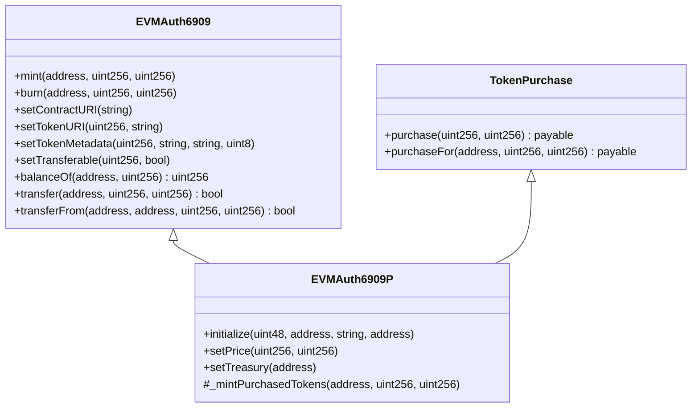
```mermaid
classDiagram
    class EVMAuth6909{
        +mint(address, uint256, uint256)
        +burn(address, uint256, uint256)
        +setContractURI(string)
        +setTokenURI(uint256, string)
        +setTokenMetadata(uint256, string, string, uint8)
        +setTransferable(uint256, bool)
        +balanceOf(address, uint256) uint256
        +transfer(address, uint256, uint256) bool
        +transferFrom(address, address, uint256, uint256) bool
    }
    class TokenPurchase{
        +purchase(uint256, uint256) payable
        +purchaseFor(address, uint256, uint256) payable
    }
    class EVMAuth6909P{
        +initialize(uint48, address, string, address)
        +setPrice(uint256, uint256)
        +setTreasury(address)
        #_mintPurchasedTokens(address, uint256, uint256)
    }
    
    EVMAuth6909 <|-- EVMAuth6909P
    TokenPurchase <|-- EVMAuth6909P
```

### EVMAuth6909P20

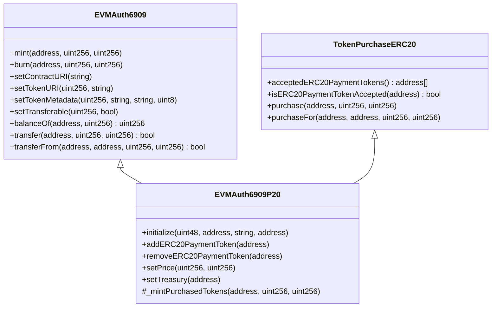
```mermaid
classDiagram
    class EVMAuth6909{
        +mint(address, uint256, uint256)
        +burn(address, uint256, uint256)
        +setContractURI(string)
        +setTokenURI(uint256, string)
        +setTokenMetadata(uint256, string, string, uint8)
        +setTransferable(uint256, bool)
        +balanceOf(address, uint256) uint256
        +transfer(address, uint256, uint256) bool
        +transferFrom(address, address, uint256, uint256) bool
    }
    class TokenPurchaseERC20{
        +acceptedERC20PaymentTokens() address[]
        +isERC20PaymentTokenAccepted(address) bool
        +purchase(address, uint256, uint256)
        +purchaseFor(address, address, uint256, uint256)
    }
    class EVMAuth6909P20{
        +initialize(uint48, address, string, address)
        +addERC20PaymentToken(address)
        +removeERC20PaymentToken(address)
        +setPrice(uint256, uint256)
        +setTreasury(address)
        #_mintPurchasedTokens(address, uint256, uint256)
    }
    
    EVMAuth6909 <|-- EVMAuth6909P20
    TokenPurchaseERC20 <|-- EVMAuth6909P20
```

### EVMAuth6909X

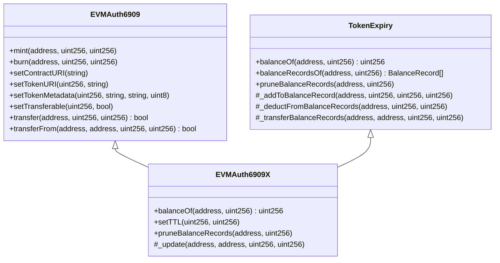
```mermaid
classDiagram
    class EVMAuth6909{
        +mint(address, uint256, uint256)
        +burn(address, uint256, uint256)
        +setContractURI(string)
        +setTokenURI(uint256, string)
        +setTokenMetadata(uint256, string, string, uint8)
        +setTransferable(uint256, bool)
        +transfer(address, uint256, uint256) bool
        +transferFrom(address, address, uint256, uint256) bool
    }
    class TokenExpiry{
        +balanceOf(address, uint256) uint256
        +balanceRecordsOf(address, uint256) BalanceRecord[]
        +pruneBalanceRecords(address, uint256)
        #_addToBalanceRecord(address, uint256, uint256, uint256)
        #_deductFromBalanceRecords(address, uint256, uint256)
        #_transferBalanceRecords(address, address, uint256, uint256)
    }
    class EVMAuth6909X{
        +balanceOf(address, uint256) uint256
        +setTTL(uint256, uint256)
        +pruneBalanceRecords(address, uint256)
        #_update(address, address, uint256, uint256)
    }
    
    EVMAuth6909 <|-- EVMAuth6909X
    TokenExpiry <|-- EVMAuth6909X
```

### EVMAuth6909XP

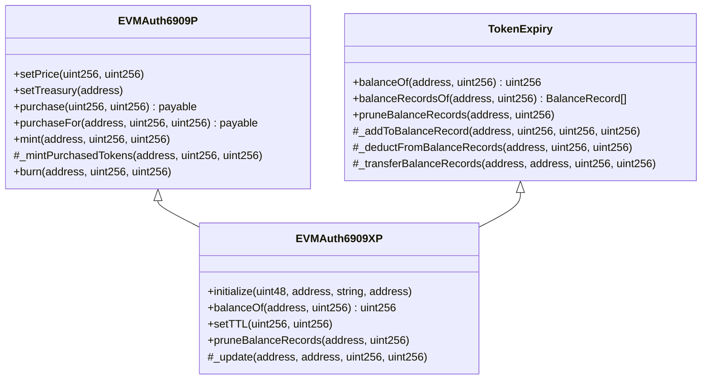
```mermaid
classDiagram
    class EVMAuth6909P{
        +setPrice(uint256, uint256)
        +setTreasury(address)
        +purchase(uint256, uint256) payable
        +purchaseFor(address, uint256, uint256) payable
        +mint(address, uint256, uint256)
        #_mintPurchasedTokens(address, uint256, uint256)
        +burn(address, uint256, uint256)
    }
    class TokenExpiry{
        +balanceOf(address, uint256) uint256
        +balanceRecordsOf(address, uint256) BalanceRecord[]
        +pruneBalanceRecords(address, uint256)
        #_addToBalanceRecord(address, uint256, uint256, uint256)
        #_deductFromBalanceRecords(address, uint256, uint256)
        #_transferBalanceRecords(address, address, uint256, uint256)
    }
    class EVMAuth6909XP{
        +initialize(uint48, address, string, address)
        +balanceOf(address, uint256) uint256
        +setTTL(uint256, uint256)
        +pruneBalanceRecords(address, uint256)
        #_update(address, address, uint256, uint256)
    }
    
    EVMAuth6909P <|-- EVMAuth6909XP
    TokenExpiry <|-- EVMAuth6909XP
```

### EVMAuth6909XP20

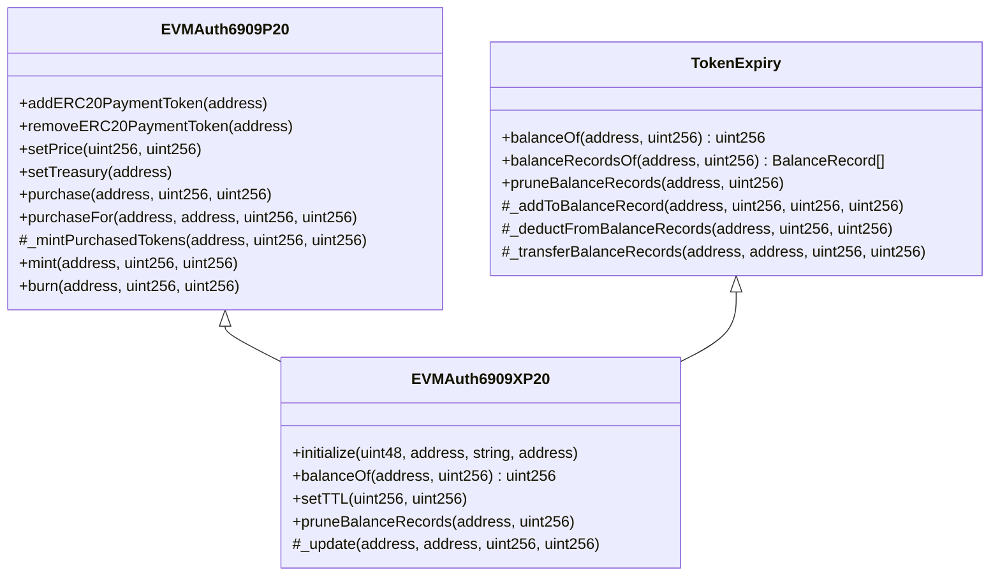
```mermaid
classDiagram
    class EVMAuth6909P20{
        +addERC20PaymentToken(address)
        +removeERC20PaymentToken(address)
        +setPrice(uint256, uint256)
        +setTreasury(address)
        +purchase(address, uint256, uint256)
        +purchaseFor(address, address, uint256, uint256)
        #_mintPurchasedTokens(address, uint256, uint256)
        +mint(address, uint256, uint256)
        +burn(address, uint256, uint256)
    }
    class TokenExpiry{
        +balanceOf(address, uint256) uint256
        +balanceRecordsOf(address, uint256) BalanceRecord[]
        +pruneBalanceRecords(address, uint256)
        #_addToBalanceRecord(address, uint256, uint256, uint256)
        #_deductFromBalanceRecords(address, uint256, uint256)
        #_transferBalanceRecords(address, address, uint256, uint256)
    }
    class EVMAuth6909XP20{
        +initialize(uint48, address, string, address)
        +balanceOf(address, uint256) uint256
        +setTTL(uint256, uint256)
        +pruneBalanceRecords(address, uint256)
        #_update(address, address, uint256, uint256)
    }
    
    EVMAuth6909P20 <|-- EVMAuth6909XP20
    TokenExpiry <|-- EVMAuth6909XP20
```

[ERC-1155]: https://eips.ethereum.org/EIPS/eip-1155
[ERC-6909]: https://eips.ethereum.org/EIPS/eip-6909
[for ERC-1155]: https://eips.ethereum.org/EIPS/eip-1155#metadata-extensions
[for ERC-6909]: https://eips.ethereum.org/EIPS/eip-6909#content-uri-extension
[for role management]: https://docs.openzeppelin.com/contracts/5.x/api/access#AccessControlDefaultAdminRules
[transfer delay]: https://docs.openzeppelin.com/contracts/5.x/api/access#AccessControlDefaultAdminRules-defaultAdminDelay--
[UUPS]: https://docs.openzeppelin.com/contracts-stylus/0.3.0-rc.1/uups-proxy
