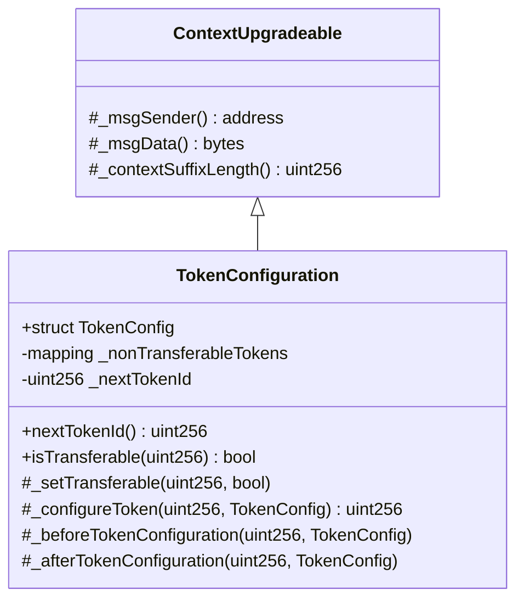
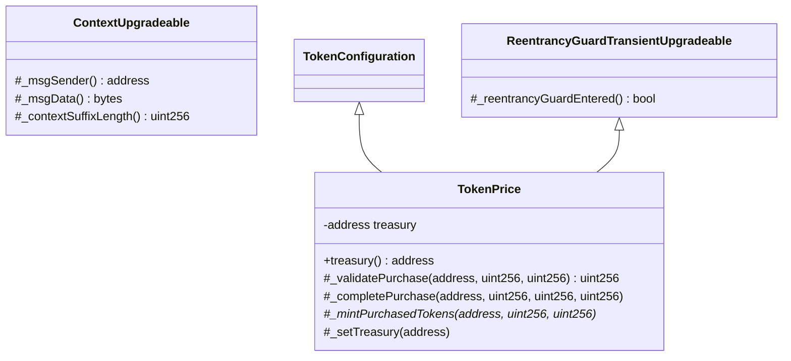
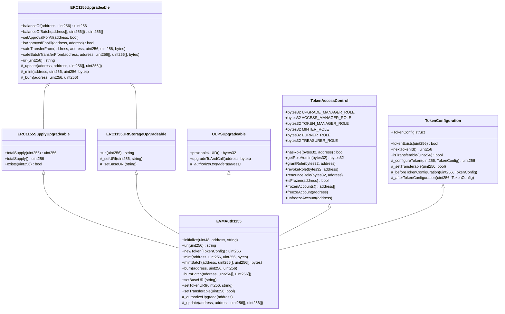
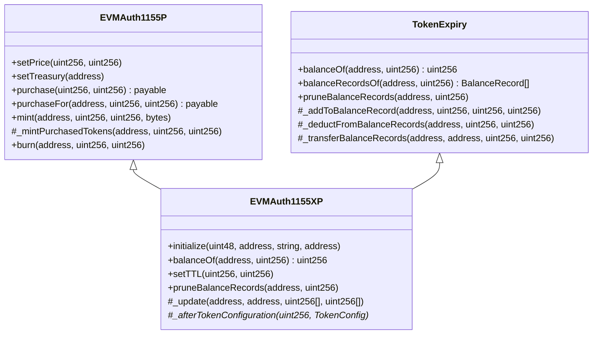
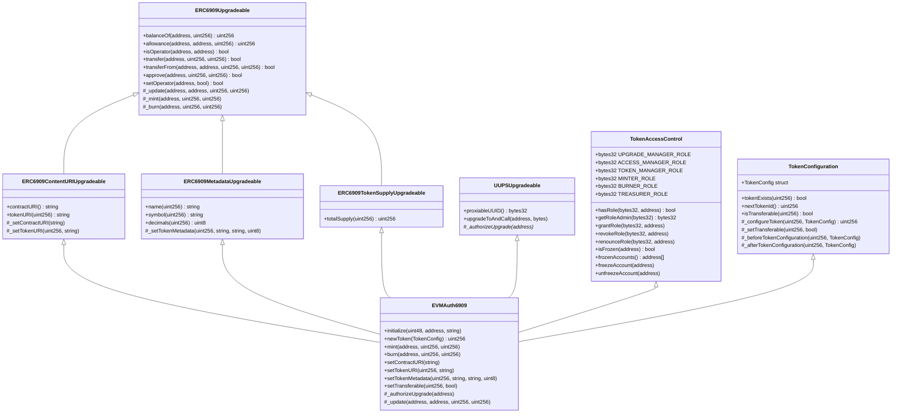

# EVMAuth Smart Contracts Architecture

## Overview

EVMAuth is an authorization state management system for token-gating, built on top of [ERC-1155] and [ERC-6909] token standards.

There are several variations of EVMAuth for each token standard, combining features like upgrade-ability, role-based access control, account freezing, and token configuration (transferability, price, TTL) with optional token expiry and direct token purchasing via native currency or ERC-20 tokens.

## Contract Features

### ERC-1155 Variants

| Contract | Token Standard | Upgradeable | Access Control | Base Config | Native Token Purchase | ERC-20 Purchase | Token Expiry |
|----------|:--------------:|:-----------:|:--------------:|:-----------:|:---------------------:|:---------------:|:------------:|
| EVMAuth1155 | ERC-1155 | ✅ | ✅ | ✅ | ❌ | ❌ | ❌ |
| EVMAuth1155P | ERC-1155 | ✅ | ✅ | ✅ | ✅ | ❌ | ❌ |
| EVMAuth1155P20 | ERC-1155 | ✅ | ✅ | ✅ | ❌ | ✅ | ❌ |
| EVMAuth1155X | ERC-1155 | ✅ | ✅ | ✅ | ❌ | ❌ | ✅ |
| EVMAuth1155XP | ERC-1155 | ✅ | ✅ | ✅ | ✅ | ❌ | ✅ |
| EVMAuth1155XP20 | ERC-1155 | ✅ | ✅ | ✅ | ❌ | ✅ | ✅ |

### ERC-6909 Variants

| Contract | Token Standard | Upgradeable | Access Control | Base Config | Native Token Purchase | ERC-20 Purchase | Token Expiry |
|----------|:--------------:|:-----------:|:--------------:|:-----------:|:---------------------:|:---------------:|:------------:|
| EVMAuth6909 | ERC-6909 | ✅ | ✅ | ✅ | ❌ | ❌ | ❌ |
| EVMAuth6909P | ERC-6909 | ✅ | ✅ | ✅ | ✅ | ❌ | ❌ |
| EVMAuth6909P20 | ERC-6909 | ✅ | ✅ | ✅ | ❌ | ✅ | ❌ |
| EVMAuth6909X | ERC-6909 | ✅ | ✅ | ✅ | ❌ | ❌ | ✅ |
| EVMAuth6909XP | ERC-6909 | ✅ | ✅ | ✅ | ✅ | ❌ | ✅ |
| EVMAuth6909XP20 | ERC-6909 | ✅ | ✅ | ✅ | ❌ | ✅ | ✅ |

## Contract Naming Convention

The contract naming follows a clear pattern:
- **Base Name**: `EVMAuth` + Token Standard (`1155` or `6909`)
- **Suffixes**:
    - `X`: Includes token eXpiry (TTL/Time-To-Live)
    - `P`: Includes price and purchasing via native currency
    - `P20`: Includes price and purchasing via ERC-20 tokens
    - `XP`: Combines expiry + purchasing via native currency
    - `XP20`: Combines expiry + purchasing via ERC-20 tokens

## Token Configuration

### TokenConfig Struct

All EVMAuth contracts use a unified `TokenConfig` struct for token configuration:

```solidity
struct TokenConfig {
    bool isTransferable;  // Whether the token can be transferred
    uint256 price;        // Price for purchase (0 = not for sale)
    uint256 ttl;          // Time-to-live in seconds (0 = never expires)
}
```

Different contract variants use different fields:
- **Base contracts** (EVMAuth1155/6909): Only use `isTransferable`
- **With TokenPrice** (P variants): Also use `price` field (0 = not for sale)
- **With TokenExpiry** (X variants): Also use `ttl` field (0 = never expires)
- **Combined** (XP variants): Use all fields

Unused fields should be set to their zero values.

### Configuration Methods

All contracts provide:
- `newToken(TokenConfig config)`: Create a new token with the next sequential ID
- `setTransferable(uint256 id, bool transferable)`: Update transferability of an existing token
- `setTokenURI(uint256 id, string uri)`: Set token-specific URI (ERC1155 and ERC6909 specific)
- `tokenConfig(uint256 id)`: Get the complete configuration for a token
- `tokenExists(uint256 id)`: Check if a token ID has been configured
- `isTransferable(uint256 id)`: Check if a token can be transferred
- `priceOf(uint256 id)`: Get the price of a token (0 = not for sale)
- `ttlOf(uint256 id)`: Get the TTL of a token (0 = never expires)
- `nextTokenId`: Public variable for the next sequential token ID

## Token Standards Comparison

### ERC-1155 vs ERC-6909

| Feature                | ERC-1155                                                                     | ERC-6909                                                                    |
|------------------------|------------------------------------------------------------------------------|-----------------------------------------------------------------------------|
| Callbacks              | Required for each transfer to contract accounts; must return specific values | Removed entirely; no callbacks required                                     |
| Batch Operations       | Included in specification (batch transfers)                                  | Excluded from specification to allow custom implementations                 |
| Permission System      | Single operator scheme: operators get unlimited allowance on all token IDs   | Hybrid scheme: allowances for specific token IDs + operators for all tokens |
| Transfer Methods       | Both transferFrom and safeTransferFrom required; no opt-out for callbacks    | Simplified transfers without mandatory recipient validation                 |
| Transfer Semantics     | Safe transfers with data parameter and receiver hooks                        | Simple transfers without hooks                                              |
| Interface Complexity   | Includes multiple features (callbacks, batching, etc.)                       | Minimized to bare essentials for multi-token management                     |
| Recipient Requirements | Contract recipients must implement callback functions with return values     | No special requirements for contract recipients                             |
| Approval Granularity   | Operators only (all-or-nothing for entire contract)                          | Granular allowances per token ID + full operators                           |
| Metadata Handling      | URI-based metadata (typically off-chain JSON)                                | On-chain name/symbol/decimals per token ID                                  |
| Supply Tracking        | Global `totalSupply()` plus per-token supply                                 | Only per-token `totalSupply(id)`                                            |

### When to Choose Which

Choose [ERC-1155] when you:
- Need NFT marketplace compatibility
- Batch operations are important
- Want receiver hook notifications
- Prefer URI-based metadata

Choose [ERC-6909] when you:
- Need ERC-20-like semantics per token
- Want granular approval control
- Need on-chain token metadata
- Prefer a simpler token transfer model

## Contract Mixins

### TokenAccessControl
Provides role-based access control:
- **Roles:**
    - `DEFAULT_ADMIN_ROLE`: Assign/revoke other roles
    - `UPGRADE_MANAGER_ROLE`: Perform contract upgrades
    - `ACCESS_MANAGER_ROLE`: Pause/unpause and account freezing
    - `TOKEN_MANAGER_ROLE`: Token configuration, pricing, and metadata
    - `MINTER_ROLE`: Minting tokens
    - `BURNER_ROLE`: Burning tokens
    - `TREASURER_ROLE`: Modify treasury account (for purchase variants)
- **Features:**
    - Pausable operations
    - Account freezing capability
    - Time-delayed admin role transfers

### TokenConfiguration
- Provides unified token configuration management
- Stores all token properties (transferability, price, TTL) in a single struct
- Manages sequential token ID assignment
- Allows marking specific token IDs as non-transferable
- Non-transferable tokens can only be minted or burned

### TokenExpiry (Time-To-Live)
- Adds automatic token expiration functionality
- Each token ID can have a configured TTL (time-to-live)
- Maintains balance records with expiration timestamps
- Automatically excludes expired tokens from balance queries
- Supports balance record pruning for gas optimization

### TokenPrice
- Extends TokenConfiguration for pricing functionality
- Treasury management for collecting revenues
- Purchase validation and completion logic
- Price is stored in the base TokenConfig struct

### TokenPurchase (extends TokenPrice)
- Direct purchase with native currency (e.g., ETH, POL)
- Automatic minting upon purchase
- Revenue collection to treasury

### TokenPurchaseERC20 (extends TokenPrice)
- Direct purchase with ERC-20 tokens (e.g., USDC, USDT)
- Support for any ERC-20 payment token
- Configurable payment token per token ID

## Key Architectural Decisions

1. **Upgradability**: All contracts use the [UUPS] (Universal Upgradeable Proxy Standard) pattern for future improvements

2. **Modularity**: Features are separated into mixins that can be combined as needed

3. **Security**:
    - Role-based access control with time-delayed admin transfers
    - Pausable operations for emergency situations
    - Account freezing capabilities
    - Reentrancy protection on purchase functions

4. **Gas Optimization**:
    - TTL implementation uses bounded arrays and time buckets for balance records
    - Automatic pruning of expired records, with manual pruning methods available
    - Efficient storage patterns for token properties

5. **Flexibility**:
    - Alternative purchase options (native, ERC-20)
    - Configurable token properties (transferability, TTL, pricing)
    - Support for both ERC-1155 and ERC-6909 token standards

## Deployment Considerations

1. **Initialization**:
    - Admin role [transfer delay]
    - Admin address [for role management]
    - Base URI ([for ERC-1155]) or Contract URI ([for ERC-6909])
    - Treasury address (for `P` and `P20` contract variants)

2. **Role Assignment**:
    - `grantRole(TOKEN_MANAGER_ROLE, address)` for accounts that can configure tokens and token metadata
    - `grantRole(ACCESS_MANAGER_ROLE, address)` for accounts that can pause/unpause the contract and freeze accounts
    - `grantRole(TREASURER_ROLE, address)` for accounts that can modify the treasury address where funds are collected
    - `grantRole(MINTER_ROLE, address)`for accounts that can issue tokens to addresses
    - `grantRole(BURNER_ROLE, address)`for accounts that can deduct tokens from addresses

3. **Token Configuration**:
    - Configure transferability
    - Set TTL (if enabled)
    - Set price (if enabled)
    - Set metadata/URI (if applicable)

## Contract Architecture

### TokenAccessControl


### TokenConfiguration



### TokenPrice



### TokenPurchase


### TokenPurchaseERC20


### TokenExpiry


### EVMAuth1155



### EVMAuth1155P


### EVMAuth1155P20


### EVMAuth1155X


### EVMAuth1155XP



### EVMAuth1155XP20


### EVMAuth6909



### EVMAuth6909P


### EVMAuth6909P20


### EVMAuth6909X


### EVMAuth6909XP


### EVMAuth6909XP20


[ERC-1155]: https://eips.ethereum.org/EIPS/eip-1155
[ERC-6909]: https://eips.ethereum.org/EIPS/eip-6909
[for ERC-1155]: https://eips.ethereum.org/EIPS/eip-1155#metadata-extensions
[for ERC-6909]: https://eips.ethereum.org/EIPS/eip-6909#content-uri-extension
[for role management]: https://docs.openzeppelin.com/contracts/5.x/api/access#AccessControlDefaultAdminRules
[transfer delay]: https://docs.openzeppelin.com/contracts/5.x/api/access#AccessControlDefaultAdminRules-defaultAdminDelay--
[UUPS]: https://docs.openzeppelin.com/contracts-stylus/0.3.0-rc.1/uups-proxy
